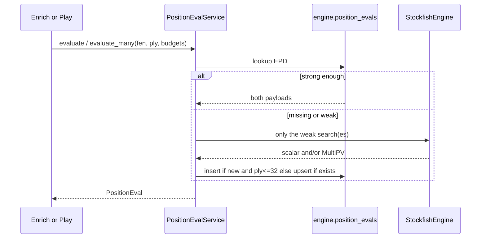

# FEN eval cache — design plan

**Status:** planning only. No implementation on this branch beyond the brief + this doc.

**Audience:** chess_teacher owner review before any code.

**Source brief:** `.agents/docs/brief-fen-eval-cache-service.md` on `feature/sf_lookup_service`.

**Last updated:** 2026-09-13 (rev: one gateway for every SF eval; ply cap 32; games are games)

---

## 1. Problem / goals / non-goals

### Problem

Stockfish is invoked from several places (expensive enrich, backfill, play live state, NN bot). Each path de-dupes (or not) in its own way. Pipeline pages forget FENs after 2000 rows. Play pays again. Same boards are the same boards, whether they came from a Chess.com ingest or a game on the site.

### Goals

- **One class, every eval, no exceptions.** Application code never calls `StockfishEngine.evaluate_*` / `evaluate_all_legal_after` for real work. Those stay the low-level binary wrapper.
- **Games are games.** Ingested backlog and live play use the same admit / LRU / upgrade rules. “Hot” means the **EPD is requested again**, not that the game was played five minutes ago.
- **Ply cap** on *new* inserts (default **game ply ≤ 32**, a bit above the earlier 16). Early middlegame still enters; deep uniques still fall off LRU after they go cold.
- **Budget upgrade in place.** One row per EPD. Stored depth/nodes are quality. Weaker stored → compute the higher request → upsert. Stronger stored → hit.
- Compute-on-miss. Cache down never blocks.

### Non-goals

- NN instead of Stockfish.
- Redis as the registry (see older speed note: skip-SF is the win).
- Changing candidate JSON shape.
- Caching cheap board metrics.
- Caching `choose_move` (Stockfish-as-opponent). That is a move pick, not an eval.
- Treating backlog as read-only / play-only-inserts (rejected).

---

## 2. The class

Working name: **`PositionEvalService`** in `pipelines/fen_eval_cache`.

This is the only application API for Stockfish **evaluations**.

```python
@dataclass(frozen=True)
class PositionEval:
    position_key: str          # EPD
    eval_white_pov: float      # scalar, white POV pawns
    eval_depth: int
    candidates: dict[str, Any] # build_candidate_payload
    candidate_nodes: int

class PositionEvalService:
    def evaluate(
        self,
        fen: str,
        *,
        ply: int | None,
        eval_depth: int = 12,
        candidate_nodes: int,
    ) -> PositionEval:
        """Always returns both scalar and candidates (compute whichever is missing/weak)."""

    def evaluate_many(
        self,
        items: Sequence[FenRequest],  # fen + ply + budgets
    ) -> dict[str, PositionEval]:
        """Batch: one lookup, SF only on misses/weak, one upsert."""
```

`evaluate_many` is what enrich / backfill / process-pool orchestration call. `evaluate` is what play / live_state / NN bot call. Same policy.

### Import DAG

`StockfishEngine` stays in `utils/chess_utils` (process-local binary). It must **not** import the cache (utils ↛ pipelines).

`PositionEvalService` lives in `pipelines/fen_eval_cache` and is the only thing that calls `evaluate_white_pov_pawns` / `evaluate_all_legal_moves_white_pov` in production.

Call sites to reroute (today they talk to the engine or `evaluate_all_legal_after`):

| Today | After |
|---|---|
| `StockfishEvaluationTransformation` | `evaluate_many` (needs scalar; service still fills candidates) |
| `CandidateEvaluationsTransformation` | same page → **one** `evaluate_many`, then stamp both mc column families |
| `scripts/ops/backfill_candidate_evals.py` | `evaluate_many` |
| `live_state.py` `evaluate_white_pov_pawns` | `evaluate` |
| `neural_baseline_bot.py` `evaluate_all_legal_after` | `evaluate` |
| `candidate_eval.evaluate_all_legal_after` / `live_candidate_tensors` | only used via the service (or deleted as a public path) |

`StockfishBot.choose_move` stays on the engine. Tests may construct a raw engine.

Workers inside `evaluate_many` may use a bare engine. They are an implementation detail of the service, not a second public path.

---

## 3. Scalar vs candidates — does it matter?

**For the product: no.** Callers should think “eval this position” and get **both**. Enrich already needs `evaluation_*` and `candidate_evaluations`. Play’s NN path wants MultiPV and often a position scalar (`evaluation_before_white` in live tensors). Doing both every time avoids a second later miss on the same EPD.

**For the implementation: yes, internally.** They are two Stockfish searches:

- Scalar: `get_evaluation()` at **depth** (today 12).
- Candidates: MultiPV-all at **num_nodes** (50k pipeline / 1k live).

The best MultiPV line is *not* a drop-in for `evaluate_white_pov_pawns`. Do not fake one from the other.

So: **one row per EPD**, two payloads, two quality numbers. The service may run 0, 1, or 2 SF calls on a request (full hit / partial / full miss). Callers do not see that.

```text
row: position_key (EPD)
     eval_white_pov + eval_depth
     payload (candidates) + candidate_nodes
     legal_uci_count
     last_access_seq
```

Identity: `(engine, engine_version, payload_version, position_key)`. Quality is updated in place.

---

## 4. Policy (same for every game)

### Ply cap (inserts only)

**Admit a new row if `ply <= 32`** (env `FEN_EVAL_CACHE_MAX_PLY`). That is game ply from `games.moves.ply` / the live board ply, not `move_nr`. Ply 32 ≈ 16 full moves: a bit later than the old “16” idea, still before the unique-mess tail.

- `ply` missing (should be rare): compute, **do not insert**, may still **upgrade** an existing row.
- `ply > 32`: compute for the caller (mc still gets the number), **no new row**, may **upgrade** if the EPD is already registered (someone hit it earlier in the opening and we transposed? unusual; cheap to allow).

Heat is LRU on **requests**, not source. A 2019 ingested game and tonight’s live game bump the same EPD the same way.

### Budget

Caller passes the budget they need (play 1k, enrich 50k, eval depth 12).

| Stored | Action |
|---|---|
| No row, ply ≤ 32 | Compute requested, insert, evict if over cap |
| No row, ply > 32 | Compute for caller only |
| Row, both qualities ≥ requested | Hit, move to top |
| Row, some quality < requested | Compute the weak part at requested, upsert, move to top |

Play at 1k against a 50k candidate row is a hit (stronger is fine). Enrich at 50k against a 1k row upgrades that row. Same EPD, same table, same class.

### LRU

Cap ~10_000 EPDs (env). `last_access_seq` move-to-front on get/upsert. Evict coldest when over cap. Not wall-clock TTL.

10k + ply 32: openings and common early lines stay if they recur; one-off ply-20 positions slide off. That is the point.

---

## 5. Enrich / play (no special cases)



`EnrichExpensive` becomes **one** service batch per page (not two transforms each talking to SF). It still writes `evaluation_*` and `candidate_evaluations` onto mc and still checkpoints. Load `ply` on the join.

Play / `live_state` / NN bot: `evaluate(...)` once per think.

---

## 6. Architecture

Postgres table + this service. No microservice. Redis still the wrong registry (upgrade/upsert/ply). Speed = skip SF.

DAG:

```
utils/chess_utils.StockfishEngine
  ↑
pipelines/fen_eval_cache.PositionEvalService
  ↑
preprocessing | backfill | live_state | neural_baseline_bot
```

---

## 7. Ops / rollout

Same as before: no new Deployment; `STOCKFISH_VERSION` lane-splits on upgrade; logs for hits, partials, upgrades, admits, skipped-admit, evicts.

| Phase | What |
|---|---|
| **1** | Table + `PositionEvalService` + tests (LRU, ply, upgrade, partial SF, degrade) |
| **2** | Reroute enrich + backfill + live_state + NN bot. Grep must show no remaining production `evaluate_*` / `evaluate_all_legal_after` outside the service. |
| **3** | Optional opening warmer (still through the service) |

---

## 8. Risks

| Risk | Mitigation |
|---|---|
| Someone bypasses the service | Phase 2 grep + code review; engine evals are “private” by convention |
| Two SF calls always | Partial hits; batch `evaluate_many` |
| Ply 32 too wide | Env knob; LRU still drops uniques |
| Scalar faked from MultiPV | Forbidden |
| `choose_move` accidentally cached | Out of scope |
| Utils importing pipelines | Service above the engine, not inside it |

---

## 9. Open questions

1. **Ply 32** vs 24 vs 40?
2. Capacity 10_000?
3. Schema name `engine.position_evals`?
4. When play asks 1k and we hold 50k, serve 50k (recommended) or exact-match flag?
5. Reprocess: still through the service (yes)?

Resolved: one gateway; backlog = live as games; ply cap kept and raised; both payloads always; play is not a privileged writer.

---

## Recommendation summary

| Topic | Decision |
|---|---|
| API | `PositionEvalService.evaluate` / `evaluate_many` only |
| Games | Same policy |
| Insert | ply ≤ 32 |
| Row | One EPD, scalar + candidates |
| Weaker budget | Upsert in place |
| Eviction | LRU ~10k |
| Engine | Low-level only, used by the service |

---

## Implementation sketch (not this PR)

1. Table + service + unit tests for policy.
2. Point enrich at `evaluate_many`; merge the two expensive transforms’ SF work.
3. Point live_state + NN bot + backfill at `evaluate`.
4. Grep-clean production eval call sites.
5. Do not change payload JSON or default node constants.

Do not add a k8s Service.
