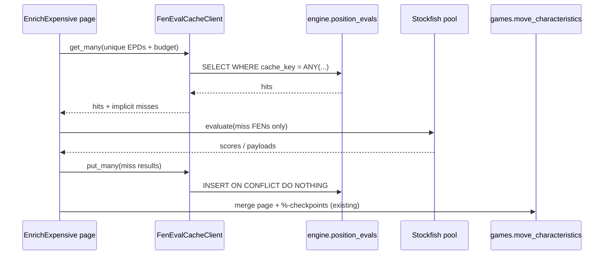
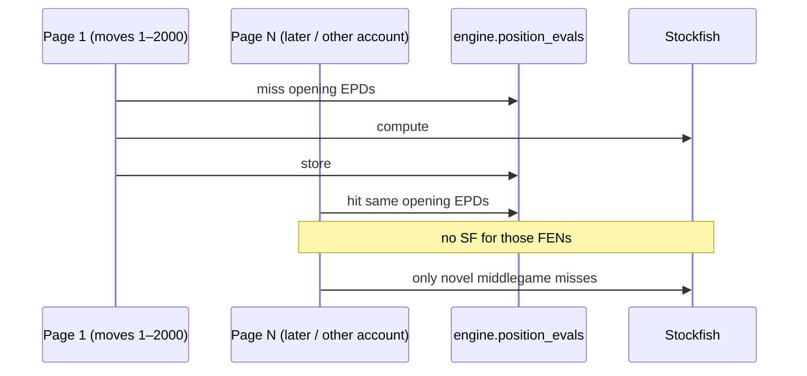

# FEN eval cache — design plan

**Status:** planning only. No implementation on this branch beyond the brief + this doc.

**Audience:** chess_teacher owner review before any code.

**Source brief:** `.agents/docs/brief-fen-eval-cache-service.md` on `feature/sf_lookup_service`.

**Last updated:** 2026-09-13

---

## 1. Problem / goals / non-goals

### Problem

`EnrichCheap` / `EnrichExpensive` now page at `TransformStep.batch_size=2000` so fat FEN + MultiPV frames do not OOM the ~4GB VPS. FEN dedup lives **inside one `transform()` call** (`FenCharacteristicTransformation._collect_unique_fens`, `CandidateEvaluationsTransformation` `fen_to_moves`). The next 2000-row page starts from zero.

One heavy account: ~737k incomplete expensive rows. Candidate MultiPV at `CANDIDATE_STOCKFISH_NODES=50_000` dominates wall-clock (~18d estimate). Played-move depth-12 eval is the same FEN-per-page pattern but much cheaper per position.

Today results land on **`games.move_characteristics` per `move_id`**, not per position. The same opening FEN is re-searched on every page, every pipeline run, every account, and again in `scripts/ops/backfill_candidate_evals.py`.

Checkpoints (`fen_checkpoint.py`, `FEN_EVAL_CHECKPOINT_PERCENT` / `CANDIDATE_EVAL_CHECKPOINT_PERCENT`) write **partial mc columns** so a crash does not lose a page. They do not share compute across pages or jobs.

### Goals

- Durable **position → engine result** store, keyed by normalized position + engine identity + budget (not bare FEN, not `move_id`).
- First consumer: `EnrichExpensiveMoveCharacteristicsStep` (played-move eval + MultiPV candidates).
- Compute-on-miss: empty/unavailable cache never blocks a pipeline.
- Stay inside existing Stockfish budget contracts (`depth=12` played-move; `CANDIDATE_STOCKFISH_DEPTH` + `CANDIDATE_STOCKFISH_NODES` for candidates).
- Fit import DAG, `metadata.yml`, `DatabaseClient`, k8s Jobs. Do not recreate OOMs by holding the world in RAM.

### Non-goals (first build)

- Replacing Stockfish with a NN evaluator.
- Cloud-managed cache (Redis Cloud, etc.).
- Changing `candidate_evaluations` train/label semantics.
- Caching cheap board metrics (legal moves, king safety, …). Those are CPU-cheap vs MultiPV.
- Rewriting stored `games.moves.fen_*` strings.
- A live play/bots consumer in phase 1 (design the key so it can join later).
- Exact-match “higher budget satisfies lower” (would mix 50k train payloads with 1k live play).

---

## 2. Cache key and value schema

### Position key (not raw `board.fen()`)

Moves store `board.fen()` (`move_extraction.py`), which includes **halfmove clock + fullmove number**. Same placement/STM/castling/EP at a different ply is a different string. Per-page dedup already uses those raw strings; a durable cache that does the same leaves a lot of transposition hits on the table.

**Normalize with python-chess EPD (4 fields):** placement, side to move, castling, en passant.

```python
def position_key(fen: str) -> str:
    return chess.Board(fen).epd()
```

Stockfish eval at our budgets does not use clocks (50-move / repetition draws are not in the search contract). Keep the original FEN on the mc row; normalize **only** for the cache key.

Invalid FEN → no cache read/write; existing transforms already warn and skip/raise.

### Engine + budget identity

Bare FEN is not a key. A row is identified by:

| Field | Played-move eval | Candidates |
|---|---|---|
| `kind` | `eval` | `candidates` |
| `engine` | `stockfish` | `stockfish` |
| `engine_version` | Debian/image SF version string (see ops) | same |
| `depth` | `12` (today’s `StockfishEvaluationTransformation`) | `CANDIDATE_STOCKFISH_DEPTH` (12) |
| `num_nodes` | `NULL` (depth-limited `get_evaluation()`) | `CANDIDATE_STOCKFISH_NODES` (50000) |
| `payload_version` | `1` | `1` |
| `position_key` | EPD | EPD |

`payload_version` bumps when mate/cp mapping, MultiPV shape, or UCI legality convention changes (`evaluation_to_white_pov_pawns`, `build_candidate_payload`). Do **not** silently reuse v1 rows after a contract change.

Do **not** put python-chess version in the key for v1. Detect legal-move drift on read instead (below).

### Surrogate primary key

```
cache_key = sha256(
  f"{kind}|{engine}|{engine_version}|{depth}|{nodes or ''}|{payload_version}|{position_key}"
).hexdigest()
```

Store the component columns too (debug, invalidation, `WHERE kind = 'candidates'`). SHA-256 collision risk is negligible; still store `position_key` and reject a row whose stored EPD does not match the lookup EPD (belt and suspenders).

### Value

**`kind=eval`**

- `eval_white_pov double precision NOT NULL` — same white-POV pawns as `evaluation_before` / `evaluation_after`.

**`kind=candidates`**

- `payload jsonb NOT NULL` — exact `build_candidate_payload` shape already on mc:

```json
{
  "depth": 12,
  "num_nodes": 50000,
  "method": "multipv_nodes",
  "evals_white_pov": {"e2e4": 0.32, "...": 0.0}
}
```

- `legal_uci_count int` — `len(evals_white_pov)` at write. On read, if `chess.Board(fen).legal_moves.count() != legal_uci_count`, treat as **miss** and recompute (python-chess / variant drift). Do not patch the payload.

Optional later: `hit_count`, `last_hit_at` for popularity eviction. Skip in phase 1 (extra writes on the hot path).

### Proposed table

New schema **`engine`** (computed engine artifacts; not `other` reference data, not per-move `games`).

`engine.position_evals`

| Column | Type | Notes |
|---|---|---|
| `cache_key` | `text` | PK, sha256 hex |
| `kind` | `text` | `eval` \| `candidates` |
| `engine` | `text` | |
| `engine_version` | `text` | |
| `depth` | `int` | |
| `num_nodes` | `int` | nullable |
| `payload_version` | `int` | |
| `position_key` | `text` | EPD |
| `eval_white_pov` | `double precision` | null when `kind=candidates` |
| `payload` | `jsonb` | null when `kind=eval` |
| `legal_uci_count` | `int` | null when `kind=eval` |
| `created_at` | `timestamptz` | default `now()` |

Indexes: PK on `cache_key`; unique `(kind, engine, engine_version, depth, num_nodes, payload_version, position_key)`; optional `(kind, engine_version)` for wipe-on-upgrade.

`metadata.yml` + `TableDataClass` next to the client (see §3). Follow existing preprocessing metadata style.

### Invalidation

| Event | Action |
|---|---|
| Depth / node budget change | New key; old rows unused |
| Mate/cp or payload shape change | Bump `payload_version` |
| Stockfish binary upgrade that should not mix | New `engine_version`; keep old rows or `DELETE WHERE engine_version = …` |
| Legal-move count mismatch | Per-row miss + overwrite |
| Full wipe | `TRUNCATE engine.position_evals` (ops, not app default) |

Never overwrite a filled row with a **lower** budget. Phase 1 write is `INSERT … ON CONFLICT DO NOTHING` (first writer wins). Reprocess / `full_reload` still recomputes mc rows; it may **read** the cache unless we add an explicit bypass flag (open question).

---

## 3. Architecture options (ranked)

Single Hetzner VPS, k3s, ~4GB RAM, no swap. Pipeline Jobs have **no resource requests** today (`orchestration/k8s/job/pipeline.yaml`) → BestEffort, OOM-killable. Redis already exists (`REDIS_URL`) as a **TTL user/admin cache**, not a durable compute store.

### Option A — Postgres table in the monolith

Library + `engine.position_evals` in the same app/DB the pipelines already use.

**Pros:** no new process, no new ingress, Doppler/k8s surface unchanged; queryable; survives job death; batch `WHERE cache_key = ANY(...)`; disk-backed (candidates are ~1–2KB JSON, must not live entirely in Redis RAM); matches `metadata.yml` / `DatabaseClient` / checkpoint habits.

**Cons:** cache IO shares the primary Postgres with games/mc/train; a huge table can bloat the same instance.

### Option B — sidecar / library + shared DB

Same storage as A. Packaging is a narrow client (`get_many` / `put_many`) so transforms do not grow ad-hoc SQL. Not a second container.

**This is how A should be coded.** Rank B as the *implementation shape* of A, not a separate deploy.

### Option C — dedicated microservice + API + storage

Own Deployment, HTTP/gRPC, own volume or DB, client in pipelines only (DAG-safe).

**Pros:** isolate play latency later; independent scale/restart.

**Cons now:** another Python process on a 4GB node; another manifest + probe + secret; failure mode the pipeline must ignore anyway (compute-on-miss); batch enrich wants set-oriented SQL, not 2000 HTTP GETs (or we build a batch API that is just a DB proxy). No second host to share with.

### Recommendation

**Monolith Postgres table now (A), implemented as a library client (B). Microservice later, not now.**

Split to C when **any** of these is true:

1. Play/bots need sub-10ms lookups at interactive QPS and cache IO shows up on Streamlit latency.
2. `engine.position_evals` is large enough that autovacuum / backup / bloat hurts games OLTP (order-of-magnitude: tens of millions of candidate rows, multi-GB JSONB).
3. A second machine should share the cache (we do not have that).
4. We want a standalone warmer that must not import the pipeline stack.

Redis is **not** the durable store. It is RAM-bound on the same VPS; `cache_utils.py` is TTL user-cache. An optional tiny Redis LRU in front of Postgres is a phase-3 optimization, not v1.

### Package boundary (import DAG)

```
utils (db, chess_utils, pipeline_utils)
  ↑
pipelines/fen_eval_cache     # table + client + key helpers  (NEW)
  ↑
pipelines/preprocessing      # EnrichExpensive transforms
  ↑
bots / play                  # later, same client
```

`utils` must not import the cache. Do not hang this off `cache_utils.py` (wrong lifetime and key style). A microservice, if ever, is **outside** the DAG; pipelines keep an HTTP client only.

Suggested files (when implementing):

- `src/chess_teacher/pipelines/fen_eval_cache/metadata.yml`
- `tables.py` — `PositionEval`
- `keys.py` — `position_key`, `build_cache_key`, `engine_version()`
- `client.py` — `FenEvalCacheClient`

---

## 4. API / client contract

In-process, sync, batch-first. No HTTP in v1.

```python
class FenEvalCacheClient:
    def get_many(self, keys: Sequence[CacheLookup]) -> dict[str, CacheHit]:
        """cache_key → hit. Missing keys omitted. Lookup/parse errors → omit (miss)."""

    def put_many(self, rows: Sequence[CacheRow]) -> int:
        """INSERT ON CONFLICT DO NOTHING. Returns inserted count. Errors → log, return 0."""
```

`CacheLookup` carries kind + budget + **original FEN** (normalize inside). `CacheHit` for `eval` is a float; for `candidates` the payload dict.

### Sync vs async populate

**Sync populate on miss** in the enrich transform: the page already has a ProcessPool + Stockfish. Adding a network hop to a warmer would not shorten the 18d backlog.

Background warmer / one-off seed is a **separate Job** (see §5), not an async queue in the request path.

### Failure modes

| Failure | Read | Write |
|---|---|---|
| Table missing (pre-migrate) | Miss all; log once | No-op |
| Postgres timeout / down | Miss all; compute | No-op |
| Corrupt JSONB / EPD mismatch / legal-count drift | Miss that key | — |
| Partial `put_many` | — | Accept; next run fills |

Cache is never on the critical path for correctness. Mc checkpoints stay the crash-safety net for **account-facing** columns.

### Feature flag

`FEN_EVAL_CACHE=off|readwrite|readonly` (env, default `readwrite` once shipped). `off` for bisect. `readonly` for a reprocess that must not pollute a new budget (rare).

---

## 5. Write path

Who fills the cache:

1. **Enrich miss (primary).** After Stockfish returns, `put_many` the new evals/payloads. Same process as today’s pool; no extra SF.
2. **Seed from existing mc (phase 1b, no SF).** One-off `scripts/ops/seed_fen_eval_cache.py` (k8s `run_script_job.py`): join `games.moves` + complete `candidate_evaluations` / `evaluation_*`, normalize FEN, insert. Fast, resumable, `ON CONFLICT DO NOTHING`.
3. **Backfill job.** Point `backfill_candidate_evals.py` at the same client so a standalone Job also writes/reads the cache. Do not invent a third Stockfish wrapper.

Do not write from cheap enrich. Do not write live play 1k-node payloads into the 50k key.



Across batches (same job or later account):



---

## 6. Read path into `EnrichExpensive*`

Keep `TransformStep` keyset paging (`batch_size=2000`, `after_key` on `move_id`). Do not load all incomplete rows. Do not join the full cache table into the page SQL (that pulls JSONB you may not need and fights the RAM cap).

Inside each transform, after collecting unique **raw** FENs:

1. Map each raw FEN → `position_key` (EPD). Several raw FENs can share one EPD (clocks).
2. `get_many` those EPDs.
3. Send **only miss FENs** into the existing serial/parallel evaluators (`_evaluate_unique_fens` / `_run_fen_pool`).
4. `put_many` miss results (best-effort).
5. Stamp columns from EPD → raw FEN → rows (same as today’s score dict).
6. Existing `bind_checkpoint` → mc merge unchanged.

Played-move eval looks up **two** EPDs per move (`fen_before`, `fen_after`). Candidates look up **`fen_before` only**.

Do not share one in-memory dict of all candidate payloads for a 737k-move job. 50% unique × ~2KB ≈ hundreds of MB plus Stockfish workers (`STOCKFISH_HASH_MB=32` each) will OOM. Pattern:

- **DB is the cross-page store.**
- Optional **small process LRU** (e.g. 5–10k candidate payloads, all scalar evals) so a page does not re-GET openings it just wrote. Cap it. Parent process only; workers stay stateless.

Cheap fen metrics: skip. Optional later if profiling says otherwise.

`EnrichExpensive` incremental filter stays `sql_expensive_incomplete` (`evaluation_after` OR `candidate_evaluations` IS NULL). Cache hits still produce mc columns so the row can complete.

---

## 7. Ops

### Deploy

No new Deployment in v1. Table is created the same way other `metadata.yml` tables are (`ensure_metadata` on first use, or an explicit migrate if you prefer a gated rollout). Pipeline / script Jobs already mount `chess-teacher-env`.

### Resources

- Do not raise Job memory blindly. Cache **reduces** SF CPU; peak RAM should stay “one page + pool + small LRU”.
- `put_many` / `get_many` batches: one SQL per page per kind (≤ ~4k eval keys, ≤ ~2k candidate keys). Fine.
- Stockfish threads/hash unchanged (`STOCKFISH_THREADS_PER_ENGINE`, `STOCKFISH_HASH_MB`).

### `engine_version`

Pin the string at write time. Prefer `STOCKFISH_VERSION` env set in the image (`stockfish --version` at Docker build) over parsing at every transform. If unset, client can exec once per process and cache. Debian `apt stockfish` can drift across image rebuilds — that is **desired** key split so mixed binaries do not share rows.

### Retention / eviction

Phase 1: **no LRU eviction.** Size math (order-of-magnitude):

- 500k candidate rows × 2KB JSONB ≈ 1GB disk
- 500k eval rows × ~200B ≈ 100MB
- Indexes on the order of 100–200MB

Acceptable on VPS disk; do not put this in Redis.

Add eviction when disk or autovacuum hurts: popularity (`hit_count`) or “unused since”, **never** delete rows that are the only copy of a budget you still train on. mc remains the account-facing store; cache is expendable compute.

### Observability

Structured logs (existing `WorkerSafeLogger` style), per page / transform:

- `fen_cache_hits`, `fen_cache_misses`, `fen_cache_hit_ratio`
- `fen_cache_put_ok`, `fen_cache_put_skipped` (conflicts)
- `fen_cache_errors` (read/write degraded)
- `fen_cache_legal_drift`
- Keep existing unique_fens / duration_s / host-pressure lines

Optional later: a tiny maintenance view (row counts by `kind`, `engine_version`). Not a new dashboard for v1.

---

## 8. Rollout phases

| Phase | What | Exit criteria |
|---|---|---|
| **0 — measure** | Prod SQL: incomplete count, `COUNT(DISTINCT fen_before)`, `COUNT(DISTINCT epd(fen_before))` for the heavy account (and platform-wide). No cache code required. Optional: log unique-FEN / page today. | Numbers in this doc’s §ETA updated from guess → measurement. Go/no-go on phase 1. |
| **1 — durable store + enrich** | `engine.position_evals` + client + wire `StockfishEvaluationTransformation` and `CandidateEvaluationsTransformation`. Flag `readwrite`. Tests: hit/miss, conflict, degrade, EPD collapse, legal drift. | One replayed page shows hits on the next page; no mc schema change; pipeline still completes with cache down. |
| **1b — seed** | `seed_fen_eval_cache.py` from existing complete mc. | Seed Job finishes; subsequent enrich hit ratio jumps on common openings. |
| **2 — backfill shares client** | `backfill_candidate_evals.py` uses the same get/put. | Standalone Job and pipeline do not double-compute the same EPD. |
| **3 — play/bots (optional)** | Live MultiPV at `LIVE_CANDIDATE_STOCKFISH_NODES` (1k) is a **different key**. Only worth it if the same position is hit often at that budget. | Play latency/error unchanged on cache miss. |
| **4 — service split** | Only if §3 triggers fire. Extract client to HTTP; table can stay Postgres. | Written decision, not a default next step. |

Phase 0 in-process “page cache → job-wide dict” **without** Postgres is **not** recommended as a shipped milestone: candidate payloads for a full 737k account do not fit RAM. A **capped LRU** can ship with phase 1 as an implementation detail, not a separate product.

---

## 9. Risks

| Risk | Why it matters | Mitigation |
|---|---|---|
| Stale budgets | Mixing depth/nodes/SF versions poisons train/play alignment | Key includes engine + budget + `payload_version`; exact match only |
| Hash collisions | Wrong eval on a move | SHA-256 + store/verify `position_key` |
| Legal-move set drift | MultiPV UCI set ≠ current `board.legal_moves` | `legal_uci_count` check → miss |
| Clockful FEN as key | Terrible hit rate | EPD normalize |
| Multi-tenant pollution | N/A today (one platform DB). Future: still **position-global** (same SF result for all users). Do not key by `account_id`. | Global cache is correct |
| VPS cost / OOM | JSONB + SF workers + page frames | Batch SQL; capped LRU; no Redis-as-source-of-truth; no full-cache load |
| Postgres bloat | JSONB updates / dead tuples | Insert-only conflict-do-nothing; no hit-count updates in v1 |
| Reprocess reads old cache | `full_reload` might not re-search SF | Flag or bypass on reprocess (open question) |
| Seed copies bad mc JSON | Garbage in → durable garbage | Seed uses `parse_candidate_evaluations`; skip invalid |

---

## 10. Open questions for the owner

1. **Phase 0 on prod:** OK to run the uniqueness SQL on the heavy account (read-only VPS `db-*`) before any schema work?
2. **Schema name:** `engine.position_evals` (recommended) vs `games.position_evals` vs `other.fen_eval_cache`?
3. **Reprocess / full_reload:** should those **bypass** the cache (always recompute + optionally overwrite) or treat cache as source of truth?
4. **SF version policy:** pin Debian Stockfish in the image and set `STOCKFISH_VERSION` at build, or accept apt drift as automatic key split?
5. **Seed job:** run 1b immediately after phase 1, or wait until enrich-only is proven on one account?
6. **Play:** keep out of v1 (recommended), or also cache 1k-node live MultiPV under its own key?
7. **Overwrite rule:** confirm `ON CONFLICT DO NOTHING` (first wins) vs “replace if same key” on explicit reprocess.

---

## Recommendation summary

| Topic | Decision |
|---|---|
| Microservice now? | **No.** Postgres table + library client. Split when §3 triggers fire. |
| Storage | `engine.position_evals` on existing Postgres |
| Key | EPD + kind + engine + version + depth + nodes + payload_version |
| Populate | Enrich miss (sync) + optional mc seed Job |
| RAM | Never materialize the full candidate cache in-process |
| First consumer | `EnrichExpensive` only |

---

## ETA impact on the ~737k-move backlog (order of magnitude)

**What the ~18d is:** ~737k incomplete mc rows × ~1 MultiPV-all @ 50k nodes on `fen_before`, already de-duped **per 2000-row page**. ~369 pages. Intra-page reuse is modest (many distinct games per page). Played-move depth-12 is second-order.

**What a durable EPD cache can save**

| Effect | Rough unique-search factor vs today |
|---|---|
| Cross-page reuse of openings on **one** account | **1.3–2×** fewer MultiPV searches |
| Plus EPD (strip clocks / transpositions) | extra **~10–30%** on top of raw-FEN unique |
| Seed from **other accounts’** complete mc | helps **new** accounts a lot; helps this backlog only for positions already computed elsewhere |
| In-process uncapped dict | **do not do this** (OOM) |

Honest range for **this** 737k backlog, cache starts empty, no seed: **~1.5–2.5×** wall-clock (18d → **~7–12d**), not 10×. Middlegames are mostly novel. Openings are the repeat.

With a successful **seed** from already-complete rows (same or other accounts), hit rate on the first N opening plies can jump; still expect middlegame misses. Unlikely to drop below **~5–8d** unless uniqueness is much higher than this guess.

**Phase 0 SQL** (adjust for the account id) is the only way to tighten this:

```sql
-- incomplete expensive rows vs unique raw FEN vs unique EPD-ish prefix
-- (EPD in SQL is approximate: first 4 FEN fields; confirm with python for EP encoding)
SELECT
  COUNT(*) AS incomplete_moves,
  COUNT(DISTINCT m.fen_before) AS uniq_fen_before,
  COUNT(DISTINCT split_part(m.fen_before, ' ', 1) || ' ' ||
                 split_part(m.fen_before, ' ', 2) || ' ' ||
                 split_part(m.fen_before, ' ', 3) || ' ' ||
                 split_part(m.fen_before, ' ', 4)) AS uniq_epd_before
FROM games.moves m
JOIN games.move_characteristics mc ON mc.move_id = m.move_id
WHERE m.account_id = $1
  AND (mc.evaluation_after IS NULL OR mc.candidate_evaluations IS NULL);
```

If `uniq_epd_before / incomplete_moves` is **> 0.8**, treat the cache as a **correctness/platform** feature (cross-account + restarts) more than a backlog silver bullet. If **< 0.5**, it is also the backlog lever.

---

## Implementation sketch (when unblocked; not this PR)

1. `pipelines/fen_eval_cache` table + client + tests (degrade, EPD, conflict, drift).
2. Hook eval + candidate transforms: get → compute misses → put → existing checkpoint.
3. Env flag + `STOCKFISH_VERSION` in image/configmap.
4. Seed script + optional backfill client share.
5. Hit-ratio logs; owner reviews one production account page-over-page.

Do not change `candidate_evaluations` JSON shape. Do not change train/play node constants. Do not add a k8s Service.
