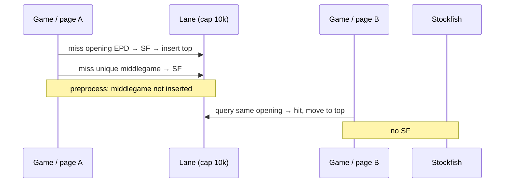

# FEN eval cache — design plan

**Status:** planning only. No implementation on this branch beyond the brief + this doc.

**Audience:** chess_teacher owner review before any code.

**Source brief:** `.agents/docs/brief-fen-eval-cache-service.md` on `feature/sf_lookup_service`.

**Last updated:** 2026-09-13 (rev: LRU capacity + play as first-class consumer)

---

## 1. Problem / goals / non-goals

### Problem

`EnrichCheap` / `EnrichExpensive` now page at `TransformStep.batch_size=2000` so fat FEN + MultiPV frames do not OOM the ~4GB VPS. FEN dedup lives **inside one `transform()` call**. The next page starts from zero. Play runs a **different** Stockfish budget (`LIVE_CANDIDATE_STOCKFISH_NODES=1000`) on the same positions and pays again.

The product is **not** “never compute a position twice.” It is a **hot-position registry**: skip Stockfish when the same EPD comes back soon (openings, the current game, a line you play every week). One-off middlegames may be recomputed. That is fine.

### Goals

- Fixed-capacity **LRU registry** of EPD → engine result, keyed by position + engine identity + budget.
- **Play is a first-class consumer.** Cache the live 1k-node MultiPV so a book move or a repeat line is instant.
- Preprocess **reads** the same idea at its own budget (50k / depth 12) so opening pages get cheaper. It must not flood the registry with the 737k-move tail.
- Compute-on-miss: empty/unavailable cache never blocks pipeline or play.
- Stay inside existing Stockfish budget contracts. Do not mix 50k train payloads with 1k live keys.
- Fit import DAG, `metadata.yml`, `DatabaseClient`. Do not hold the world in RAM.

### Non-goals (first build)

- Replacing Stockfish with a NN evaluator.
- Cloud-managed cache (Redis Cloud, etc.).
- Changing `candidate_evaluations` train/label semantics.
- Caching cheap board metrics (legal moves, king safety, …).
- Rewriting stored `games.moves.fen_*` strings.
- “Higher budget satisfies lower” (50k row used as a 1k play hit).
- Seeding the registry from the entire complete `move_characteristics` table (that is the opposite of LRU).

---

## 2. Cache key and value schema

### Position key (not raw `board.fen()`)

Moves store `board.fen()` (`move_extraction.py`), which includes **halfmove clock + fullmove number**. Same board in two games is often a different string.

**Normalize with python-chess EPD (4 fields):** placement, side to move, castling, en passant.

```python
def position_key(fen: str) -> str:
    return chess.Board(fen).epd()
```

Clocks do not change our Stockfish contract. Keep the original FEN on the mc / play board; normalize **only** for the cache key.

### Engine + budget identity

| Field | Played-move eval | Pipeline candidates | Play candidates |
|---|---|---|---|
| `kind` | `eval` | `candidates` | `candidates` |
| `engine` | `stockfish` | `stockfish` | `stockfish` |
| `engine_version` | image SF version | same | same |
| `depth` | `12` | `CANDIDATE_STOCKFISH_DEPTH` (12) | 12 |
| `num_nodes` | `NULL` | `50000` | `1000` (or `live_candidate_stockfish_nodes()`) |
| `payload_version` | `1` | `1` | `1` |
| `position_key` | EPD | EPD | EPD |

These combinations are **lanes**. LRU capacity is **per lane**, so a preprocess flood cannot evict play’s 1k-node openings (and a Stockfish upgrade is a new empty lane, not a wipe of the old one).

`payload_version` bumps when mate/cp mapping or MultiPV shape changes. Do not put python-chess version in the key; detect legal-move drift on read.

### Surrogate primary key

```
cache_key = sha256(
  f"{kind}|{engine}|{engine_version}|{depth}|{nodes or ''}|{payload_version}|{position_key}"
).hexdigest()
```

Store the component columns too. On read, reject a row whose stored EPD does not match the lookup EPD.

### Value

**`kind=eval`:** `eval_white_pov` (white-POV pawns).

**`kind=candidates`:** existing `build_candidate_payload` JSONB + `legal_uci_count`. If `board.legal_moves.count() != legal_uci_count`, treat as miss and recompute.

### Proposed table

Schema **`engine`**. Table `engine.position_evals`.

| Column | Type | Notes |
|---|---|---|
| `cache_key` | `text` | PK |
| `kind` | `text` | `eval` \| `candidates` |
| `engine` | `text` | |
| `engine_version` | `text` | |
| `depth` | `int` | |
| `num_nodes` | `int` | nullable |
| `payload_version` | `int` | |
| `position_key` | `text` | EPD |
| `eval_white_pov` | `double precision` | null when `kind=candidates` |
| `payload` | `jsonb` | null when `kind=eval` |
| `legal_uci_count` | `int` | null when `kind=eval` |
| `last_access_seq` | `bigint` | LRU cursor (see §2.1) |
| `created_at` | `timestamptz` | default `now()` |

Indexes: PK; unique `(kind, engine, engine_version, depth, num_nodes, payload_version, position_key)`; **`(kind, engine, engine_version, depth, num_nodes, payload_version, last_access_seq)`** for eviction.

`metadata.yml` + `TableDataClass` next to the client.

### 2.1 LRU: “TTL” in new positions, not wall-clock

Owner model (agreed):

1. Miss → run Stockfish → insert at the **top** of that lane.
2. Hit → **move that row to the top** (queried again = hot).
3. Lane is a **fixed-capacity ordered registry** (default **10_000** rows per lane, env `FEN_EVAL_CACHE_LANE_CAPACITY`).
4. When a insert would exceed capacity, delete the **bottom** (least recently accessed). A one-off EPD that never comes back falls off after ~10k *other* EPDs have been admitted. Hot EPDs are touched on every lookup and never fall off.

This is **LRU**, not Redis-style time TTL. “After 10k new EPDs” is what happens once the lane is **full**. Do **not** expire a row after 10k inserts if the lane still has room (that would empty a young cache for no reason). Capacity-based LRU and “generation TTL of 10k” are the same only after the lane is full.

Do **not** implement a linked list in Postgres. Use a monotonic sequence:

```text
get_many hits  → UPDATE last_access_seq = nextval(...) WHERE cache_key = ANY(...)
put_many new   → INSERT ... last_access_seq = nextval(...)
then           → DELETE FROM lane ORDER BY last_access_seq ASC
                 LIMIT greatest(lane_count - capacity, 0)
```

One batched `UPDATE` per `get_many`, not one statement per FEN. Play can bump a single row per move.

Approximate LRU (skip a bump if the row was already near the top) is an optional later tweak if the `UPDATE` shows up in traces. Start exact.

### Admission (what we refuse to insert)

LRU only stays “hot openings + recent play” if **garbage is not admitted**. A preprocess page of ~2k unique middlegames, written in full, pushes ~2k cold rows off the **preprocess lane**. After a few pages, last night’s openings are gone even if play’s lane is safe.

| Source | On miss, after SF | On hit |
|---|---|---|
| **Play** | **Always insert** (tiny volume, this is the point) | Move to top |
| **Preprocess / backfill** | Insert only if **ply ≤ N** (recommend **N = 16**, env) or the EPD is **already in the lane** (refresh) | Move to top |
| **Seed job** | Only low-ply rows from existing mc, same N. Never dump all complete mc. | — |

Ply is already on `games.moves`. `EnrichExpensive` must load `ply` (or `move_nr`) with the page to apply the gate. Play always has a ply.

Recompute of a high-ply preprocess miss still writes **`move_characteristics`**. It just does not enter the registry.

### Invalidation

| Event | Action |
|---|---|
| Depth / nodes / SF version / payload_version change | New lane; old lane ages out unused or is `DELETE`d |
| Legal-move count mismatch | Miss + replace that row |
| Full wipe | `TRUNCATE` (ops) |
| Reprocess | Still **reads** LRU; high-ply still not admitted (open: bypass flag) |

Same-key write: `ON CONFLICT` → bump `last_access_seq`, do **not** overwrite eval/payload unless an explicit reprocess flag says so (first result wins).

---

## 3. Architecture options (ranked)

Single Hetzner VPS, k3s, ~4GB RAM. Redis already exists as a **wall-clock TTL** user/admin cache (`cache_utils.py`). That is a different job.

### Option A — Postgres table in the monolith

**Recommendation.** 10k candidate rows × ~2KB ≈ 20MB per lane. Several lanes still tiny. Disk LRU, queryable, survives Jobs, batch `ANY(...)`.

### Option B — library client + same table

How A is coded (`get_many` / `put_many` / `touch` / `evict_lane`). Not a sidecar process.

### Option C — microservice

Still later. Play latency is dominated by Stockfish on miss, not by a Postgres primary-key get. Split if Streamlit ever waits on cache IO or we grow a second host.

Redis LRU is tempting (native `MAXMEMORY` + `allkeys-lru`) but candidate JSON on the same 4GB box competes with user-cache RAM. Postgres wins for v1. Optional Redis *front* later.

### Package boundary

```
utils (db, chess_utils, pipeline_utils)
  ↑
pipelines/fen_eval_cache     # table + client + LRU helpers
  ↑
pipelines/preprocessing      # EnrichExpensive (read + gated write)
  ↑
bots / play                  # same client, write-all-misses
```

---

## 4. API / client contract

```python
class FenEvalCacheClient:
    def get_many(self, keys: Sequence[CacheLookup]) -> dict[str, CacheHit]:
        """Hits only. Touches LRU (batched). Errors → empty (all miss)."""

    def put_many(self, rows: Sequence[CacheRow]) -> int:
        """Insert new keys at top; ON CONFLICT touch only.
        Then evict lane bottoms past capacity. Errors → 0."""
```

`CacheLookup` includes kind + budget + original FEN (+ optional `admit: bool` from the caller’s ply gate). Client does not guess ply.

Failure: table missing / Postgres down → compute-on-miss, no crash. Feature flag `FEN_EVAL_CACHE=off|readwrite|readonly`.

---

## 5. Write path

```mermaid
sequenceDiagram
  participant P as Play or Enrich page
  participant C as FenEvalCacheClient
  participant PG as engine.position_evals
  participant SF as Stockfish
  participant Out as mc row or play UI

  P->>C: get_many(EPDs + lane)
  C->>PG: SELECT + bump last_access_seq on hits
  PG-->>C: hits
  C-->>P: hits / misses
  P->>SF: miss FENs only
  SF-->>P: scores / payloads
  alt play OR preprocess ply <= N
    P->>C: put_many(misses)
    C->>PG: INSERT at top; DELETE lane bottom if over cap
  else preprocess high ply
    Note over C,PG: compute used for mc only; not admitted
  end
  P->>Out: existing checkpoint / live move
```

Hot path across games:



---

## 6. Read path

### EnrichExpensive

Keep `batch_size=2000` keyset paging. After unique raw FENs:

1. EPD-normalize (many raw FENs → one key).
2. `get_many` (hits move to top).
3. Stockfish on misses only.
4. `put_many` only admitted misses (ply ≤ N).
5. Stamp mc columns for **all** rows (admitted or not). Checkpoints unchanged.

Load `ply` on the expensive join. Played-move eval: two EPDs per move. Candidates: `fen_before` only.

### Play

On each engine think: `get_many` one EPD at the **1k-node** lane. Hit → skip MultiPV. Miss → live SF → `put_many`. Takebacks / repeats / book lines hit. Opponent novelties miss once and then sit at the top for the rest of the game.

Do not read the 50k preprocess lane from play (different numbers than train/live alignment for the 1k path).

No process-wide unbounded dict. A tiny in-process LRU (dozens of positions) is optional in front of Postgres for a single game.

---

## 7. Ops

- No new Deployment. `ensure_metadata` (or a gated migrate).
- Capacity 10k × a few lanes is tens of MB, not 1GB. Do not raise Job RAM for the cache.
- `STOCKFISH_VERSION` in the image so lanes split cleanly on apt drift.
- Eviction is **inline** on `put_many` (same transaction as insert). No nightly janitor required. Optional maintenance: log `lane_count`, `evicted`.
- Observability: `fen_cache_hits`, `fen_cache_misses`, `fen_cache_admitted`, `fen_cache_not_admitted`, `fen_cache_evicted`, `fen_cache_errors`, `fen_cache_legal_drift`.

---

## 8. Rollout phases

| Phase | What | Exit criteria |
|---|---|---|
| **0 — measure** | Optional uniqueness SQL (still useful). More important: confirm play is the latency pain and pick N / capacity. | N and cap written down (16 / 10k unless owner says otherwise). |
| **1 — registry + play + gated enrich** | Table + client + LRU. Wire play 1k lane (write all misses). Wire enrich read + ply gate. Tests: touch-on-hit, evict-bottom, lane isolation, admission skip, degrade. | Play book/repeat line skips SF. A 10k+1 insert drops the coldest. Preprocess page of high-ply misses does not grow the play lane. |
| **2 — backfill uses the same client** | Same get + gated put. | Backfill cannot evict play. |
| **3 — optional seed** | Low-ply-only seed from mc into the matching lanes. | Seed does not exceed cap; evicts only colder low-ply if over. |
| **4 — service split** | Only if §3 triggers. | Written decision. |

---

## 9. Risks

| Risk | Why it matters | Mitigation |
|---|---|---|
| Preprocess write-all | 2k new EPDs/page evict openings in **that** lane | Ply admission; play on its own lane |
| Same lane for 1k and 50k | Pipeline would evict play | `num_nodes` in the key |
| Recency `UPDATE` amplification | Extra writes on every hit | Batched touch; skip later if needed |
| Wall-clock TTL by mistake | Idle play would lose book after a week | Seq LRU only |
| Evict when not full | Young cache empties | Capacity check, not “age > 10k” |
| Stale budgets | Train/play mismatch | Exact lane match |
| Legal-move drift | Wrong UCI set | `legal_uci_count` → miss |
| Reprocess | Might want fresh SF | Optional bypass flag |
| Cap too small | Opening repertoire + recent play do not fit | 10k is a lot of EPDs; raise env |

---

## 10. Open questions for the owner

1. **Capacity 10_000 per lane** — good default? (10k × ~2KB ≈ 20MB/lane.)
2. **Ply gate N = 16** for preprocess admission — or 12 / 20 / “openings only if already seen twice”?
3. **Schema name** `engine.position_evals` vs `games.position_evals`?
4. **Reprocess** bypass cache or still read LRU?
5. **SF version** pin in image vs apt drift as a new lane?
6. **Play first in phase 1** (recommended) vs enrich-only first?

Resolved by this revision: eviction is LRU-by-access with a fixed cap, not wall-clock TTL; play is in v1; we do not store the full backlog.

---

## Recommendation summary

| Topic | Decision |
|---|---|
| Product | Hot registry, not infinite memoization |
| Eviction | Per-lane LRU, cap ~10k, move-to-front on query |
| “TTL” | Count of **other admitted EPDs** after the lane is full, not seconds |
| Play | Own 1k-node lane; write every miss |
| Preprocess | Read all; write only ply ≤ N |
| Microservice | Not now |
| Storage | `engine.position_evals` on existing Postgres |

---

## ETA impact (order of magnitude)

**Play:** first miss in a line pays live 1k MultiPV; every repeat / takeback / next game in the same book is a hit. That is the speed win. Unrelated novelties still compute once.

**737k preprocess backlog:** only **opening plies** hit or get admitted. Middlegames still run Stockfish. Expect a **modest** pipeline speedup (book pages, not 2× on the whole 18d) unless uniqueness on low ply is huge. The cache is for **play + opening reuse**, not for finishing the backlog.

Phase 0 uniqueness SQL is still optional; it no longer gates the design.

---

## Implementation sketch (when unblocked; not this PR)

1. `pipelines/fen_eval_cache`: table with `last_access_seq`, client, lane evict, tests (LRU order, cap, lane isolation, admission, degrade).
2. Play: get → SF miss → put at 1k lane.
3. Enrich: load `ply`; get; SF misses; put if ply ≤ N.
4. Logs + env: capacity, N, flag, `STOCKFISH_VERSION`.

Do not change `candidate_evaluations` JSON shape. Do not change train/play node constants. Do not add a k8s Service.
