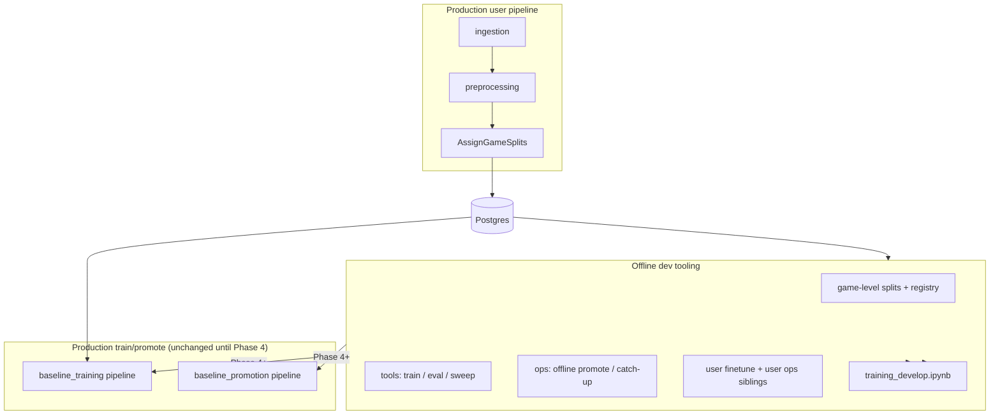
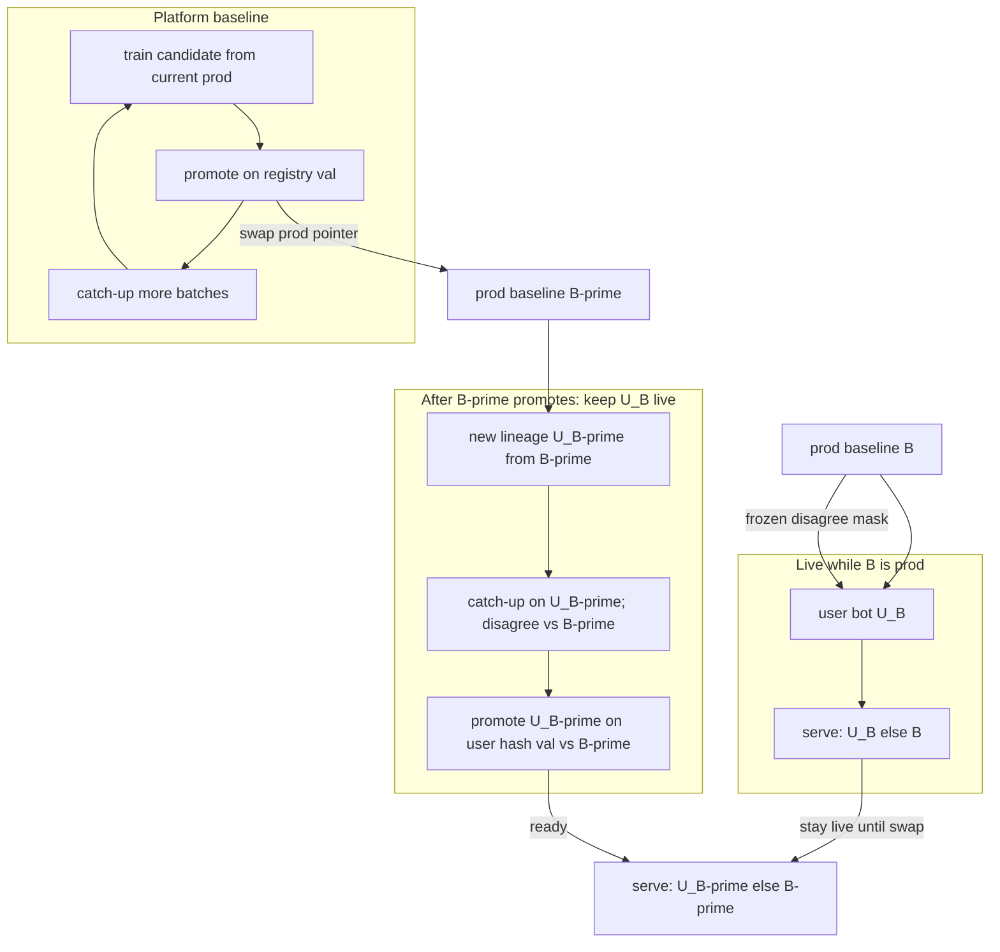

# ML training roadmap — baseline + personalized bots

**Status:** Phase 1 + 1b on `develop`. Game-split **assignment** runs in the daily user `PipelineRunner` after preprocess (not train/promote). Phase 2a **tools + `DEFAULT_EPOCHS=20`**. Phase 2b **tools + first 10k experiments** (keep `128/64`; feat v4 skipped). Production train/promote unchanged until Phase 4.

**Audience:** humans and coding agents working on `src/chess_teacher/pipelines/neural_network/`

**Last updated:** 2026-09-04 (rev: shared train+promote object)

**Train fetch / orchestration:** one shared train+promote object for baseline and personal. See [ml-train-queue.md](ml-train-queue.md). Do not add hash-scan cursors or `end_time` cutoffs as the train loader.

---

## North star — production-ready orchestrated training

Phases 1–3 are **offline proof**. Phase 4 is the **deliverable you orchestrate** on the platform (same shape as today: train entrypoint → promote entrypoint → catch-up ops).

**End state (Phase 4+):**

| Job | Orchestrated entrypoint | Behaviour |
|-----|-------------------------|-----------|
| Incremental baseline train | `scripts/entrypoints/baseline_training.py` | Same **train+promote object** as personal ([ml-train-queue.md](ml-train-queue.md)): assign → queue round → maybe promote. Mark `already_processed_baseline`. |
| Promote candidate | `scripts/entrypoints/baseline_promotion.py` | Same object, step 8. Frozen registry val; disagree margin + agree guardrail. On success: reset personal **training** schemes. |
| Catch up backlog | `scripts/ops/baseline_train_until_caught_up.py` | Loop of that same object |
| User finetune | same object, user scope | Filter linked-account train; mark `already_processed_personal`; parent = last personal keras else `baseline_parent_id`; store that id on every personal row |

Offline **ops siblings** (`offline_baseline_*`, `offline_user_*`) must behave like production **before** Phase 4 wires them in — Phase 4 is a port, not a redesign.


---

## Design assumptions (agreed)

These choices simplify the roadmap; revisit only if metrics or product needs change.

| Topic | Assumption |
|-------|------------|
| **User overlap train/val** | Acceptable for platform baseline. A few moves per user in val do not reveal full style; signal comes from aggregate volume. |
| **Game-level split** | Required — never split moves within the same game. |
| **Offline sample size** | Small `--limit` runs are smoke tests only. Serious comparisons need **≥10k moves** (preferably more val games, e.g. hundreds). |
| **Incremental production training** | Registry work queue ([ml-train-queue.md](ml-train-queue.md)): `bucket='train'` + processed flag NULL, `ORDER BY game_id`, complete games. `games.end_time` is **not** the fetch cursor. |
| **Recency (baseline)** | Optional **sample weights** within each new batch can emphasize fresher moves (`end_time`). Processed flags (not `end_time`) are what restrict each round to **unseen** train games. |
| **Recency (user bots)** | Capped recency sample weights + same `baseline-v1` hash val as platform (Phase 3). |
| **Baseline-disagree (user bots)** | Hard-mask vs `baseline_parent_id` stored on the personal row (promoted baseline that **started this scheme**), not vs last personal keras and not a live re-query of production each round. |
| **User bot on baseline promote** | Reset personal **training** only (clear personal flags; new scheme parent = newly promoted baseline). Last personal **production** stays serving; it is not a train parent. Swap serving when the new personal candidate promotes. |
| **Baseline capacity** | Shared trunk must grow as platform user diversity grows — enables effective per-user finetune later (wider/deeper ≠ per-user input dims). |
| **Input features** | Separate hypothesis: richer **cues** per position (phase-specific structure, etc.) — investigate before feat version bump. |
| **Existing `baseline_models` (v50 / v51, ~2026-08)** | **POC only.** Deletable. Do **not** spend on `--full-val` or artifact archaeology vs those URIs. Optional cheap `--train-inline` vs production on the same `--limit` slice is nice-to-have, never a gate. New work is ranked on **registry val vs itself**. Phase 4 starts a **fresh** train/promote chain. |

---

## Incremental training vs held-out eval (important)

**Fetch is the registry work queue** ([ml-train-queue.md](ml-train-queue.md)): unprocessed train games in `game_id` order, complete games, mark after a successful fit. That replaced both oldest-first `fetch_since` (as a train cursor) and the hash-scan / `ingested_at` snapshot cursor. Val/test buckets and `game_id` order stay.

Offline catch-up (baseline **and** user, each scoped to its own eligible games) trains in **`game_id` order**, not `end_time` order. Oldest-first `fetch_since` made each 10k batch a single era (e.g. 2021) while hash val mixed 2021-2026.

Hash-scan code (`hash_scan.py`, `HashScanCursor`, `seen_late`, epoch roll, `hash_scan_cursor.json`) is **deleted**. Do not reintroduce it.

Three clocks stay separate:

| Clock | Column | Job |
|-------|--------|-----|
| Event time | `games.end_time` | Recency **sample weights** only |
| Arrival time | `games.raw_games.ingested_at` | Ingestion bookkeeping (not a train cursor) |
| Scan order | `game_id` | Stable era mix; complete games; never split a game across batches |

`--limit` on one-shot user/baseline **finetune** caps hash-train by sorted `game_id` (complete games), not oldest `end_time`. Catch-up uses `--batch-limit` + processed flags; `--limit` does not shrink the catch-up universe.

Two concerns that stay **orthogonal**:

| Concern | Mechanism | Purpose |
|---------|-----------|---------|
| **Incremental learning** | Registry queue (`game_id` order) + parent weights | Model adapts to new data; each batch is era-mixed |
| **Honest offline metrics** | Persistent game hash → val / test | Know if model generalizes to held-out games it never trained on |
| **Emphasize latest within a batch** | Capped recency sample weights on `end_time` | `w *= 1+(BOOST-1)*exp(-lam*age)` (user BOOST=2; missing `end_time` strength=0) |

**Offline experiments** should mirror the Phase 4 target:

- **Fixed val set** (persistent hash): score every candidate the same way — promotion-quality metric.
- **Queue batch replay**: train next unprocessed `game_id` page, eval frozen val; repeat.

Do **not** conflate “val must be future games” with “training must be incremental.” Hash val measures generalization; the queue (not a time-val split) is what walks new data.

---

## Purpose

This document captures the agreed phased plan for:

1. Fixing train / validation / test hygiene as baseline training matures
2. Improving baseline model quality (features, capacity) with honest metrics
3. Building **personalized user bots** on top of baseline models
4. Adding **recency bias** for user finetune (not baseline)
5. Delivering a **production-ready, orchestratable** training + promotion routine (Phase 4)

During **Phases 1–3**, implement **library code** under `pipelines/neural_network/` plus **thin scripts** under `scripts/tools/` and `scripts/ops/`. Do **not** wire new logic into `run_baseline_training_pipeline()` / `run_baseline_promotion_pipeline()` until Phase 4.

**Interim (Phases 1–3):** `AssignGameSplitsStep` runs from the per-account user `PipelineRunner` via `run_assign_game_splits_pipeline()` so `ml.game_split_assignments` stays current. That is assignment only — not train exclusion or promotion eval. **Phase 4:** drop the standalone split “pipeline”; fold assignment into preprocessing (or a direct `split_registry` call). See [Pipeline consolidation](#pipeline-consolidation-phase-4).

---

## Experimental questions (what each phase must answer)

Use **registry val** + stratified metrics unless noted. Primary success metric for style work: **`top1_sf_disagree`**.

### Baseline — measurement & splits (Phase 1 / 1b) ✅

| # | Question | How we know |
|---|----------|-------------|
| E1 | Do game-level splits give stable, reproducible val sets? | Same `split_version` → same val games across runs |
| E2 | Are stratified metrics computable and sensible? | agree_t1 ≥ disagree_t1 typically; counts in split summary |

**Reference run (trusted for relative compares, not locked HPs):** `--limit 10000`, cold 128/64, 3 epochs, registry val `disagree_t1≈0.20`.

### Baseline — tuning & comparison (Phase 2a)

| # | Question | How we know |
|---|----------|-------------|
| E3 | What epoch count minimizes val loss without overfitting train? | **Justified pick `20`.** Grid 3–20 on `--limit 10000` (32 val games): `disagree_t1` still climbing (3: 0.20 → 20: 0.265); va_loss still falling; train–val top1 gap modest (0.008 at 20). No plateau. Revisit in 2b if larger val or replay disagrees. |
| E4 | *(optional)* Cheap sanity: new cold train vs POC production URI on the **same `--limit` val slice** | Done informational: inline@20 vs v50, `disagree_t1 +0.057` on 32-game slice. **Not a gate.** Skip `--full-val` vs v50/v51. |
| E5 | Do defaults hold at `--limit 10000+`? | 10k sample only so far; val games=32 ≪ registry val (1311). 2b replay / larger sample can revisit. |

### Baseline — capacity, features, incremental (Phase 2b)

| # | Question | How we know |
|---|----------|-------------|
| E6 | As user diversity in DB grows, does **disagree_t1 plateau** at current capacity? | First 10k arch sweep: **256-wide lost** on disagree vs 128. Capacity not the bottleneck on this sample. Revisit when val games >> 32. |
| E7 | Does **wider/deeper** trunk improve val **disagree** more than agree? | **No on this grid.** 128/128 `disagree_t1=0.2653` vs 128/64 `0.2639` (noise). 256/128 `0.2553`, 256/64 `0.2454`. Keep **`DEFAULT_HIDDEN=128` / `DEFAULT_SCORE_HIDDEN=64`**. |
| E8 | Are **missing position cues** (not capacity) the bottleneck? | Arch: width did not help. Phase slice: **opening** is weakest `disagree_t1` (0.22), **endgame strongest** (0.37). Do **not** ship endgame-only feat v4 from this sample. |
| E9 | Does incremental replay (catch-up shape) keep val stable or improving? | 3 rounds `--val-limit 10000` `--epochs 20` `--max-rounds 3` (exit 3 = more data left, ~361k eligible). Frozen val 32 games. `disagree_t1`: 0.2525 → 0.2611 → 0.2454. **Wiggles, not monotone.** Sibling works; do not treat as a lock that replay always helps. |

### Baseline — feature investigation (Phase 2b, before feat v4)

| # | Question | How we know |
|---|----------|-------------|
| E10 | Which **game-phase slices** hurt most today? | Catch-up round-2 model, same 10k val slice: opening `disagree_t1=0.2186` (n=384), middle `0.2552` (n=523), endgame `0.3675` (n=257). **Opening weakest; endgame strongest.** |
| E11 | Do candidate features (e.g. **passed pawns**, rook on 7th, king activity) correlate with errors in endgame disagree positions? | Shortlist of 30 endgame SF-disagree top1-miss FENs exists (rook endings / pawn races / N vs pawns). **Not enough to justify feat v4:** endgame is already the best slice. |
| E12 | Does adding a small feat set improve **endgame disagree_t1** without hurting opening/middle? | **Skipped.** Investigation did not support an endgame-cue bump. Revisit if targeting **opening** disagree, on a larger val. |

**Feat investigation process (lightweight):**

1. **Audit** — cues already in state/move feats (`is_end_game` in state today; no passed-pawn count yet). See `create_training_set.py`, `candidate_eval.py`, `fen_metrics.py`.
2. **Error analysis** — on registry val, find failures where phase = endgame (middlegame if needed).
3. **Shortlist** — e.g. passed pawn count (user/opponent), protected passed, pawn race flags — derive from FEN at pack time.
4. **Prototype** — add to move or state vector; bump `CANDIDATE_MOVE_FEAT_VERSION` only when A/B on val shows gain (disagree + endgame slice).
5. **Separate from capacity** — never change hidden size and feat layout in the same experiment.

### User bots (Phase 3)

| # | Question | How we know |
|---|----------|-------------|
| E13 | Does user finetune beat baseline on **that user's val disagree**? | `offline_user_finetune_eval.py` on hash val (same `baseline-v1` salt; stratified t1) |
| E14 | Does recency weighting improve recent-opening / recent-style positions? | Ablate λ / recency BOOST; optional opening-family slice. No recency-weighted val metric. |
| E15 | Is a **wider baseline parent** required for user lift? | 2b 10k: **no** (keep 128/64). User finetune vs that parent first; only re-open width if user lift saturates. |

### Production readiness (Phase 4)

| # | Question | How we know |
|---|----------|-------------|
| E16 | Does orchestrated train **never** leak val/test into batches? | Integration test / DB query: no val `game_id` in training batch |
| E17 | Does promotion on registry val match offline promotion sibling? | Same candidate URI → same metrics ± float tolerance |
| E18 | Does catch-up on platform match offline catch-up behaviour? | One develop run: round-by-round val parity |

---

## Experiment surfaces (scripts + notebook)

Same capabilities should be reachable from three places — **one library, many thin wrappers**:

| Surface | Role | Persists to pipeline DB? | When |
|---------|------|--------------------------|------|
| **`scripts/tools/`** | Single-shot experiments, sweeps, backfill | Usually no (terminal metrics) | Phases 1–3 |
| **`scripts/ops/`** | Sibling loops mimicking platform ops (catch-up, promote) | Optional MLflow later; not `baseline_models` until Phase 4 | Phase 2–3 |
| **`scripts/entrypoints/`** | Production-style jobs (orchestrated on platform) | Yes — candidates, cutoff, promotion | Phase 4+ |
| **`training_develop.ipynb`** | Interactive develop — inspect, train, compare, plot | Same as whichever cell you run (often pipeline today) | All phases — extend over time |

**Rule:** put logic in `splits.py`, `eval_metrics.py`, `split_registry.py`, trainers, etc. Scripts and notebook cells **call libraries** — do not duplicate training/eval logic in the notebook only.

### Baseline: script siblings vs production entrypoints

| Production (today) | Split-based sibling (offline) | Phase |
|--------------------|----------------------------------|-------|
| `scripts/entrypoints/baseline_training.py` | `scripts/tools/offline_baseline_train_eval.py` ✅ | 1 |
| `scripts/entrypoints/baseline_promotion.py` | `scripts/ops/offline_baseline_promotion.py` ✅ | **2a** |
| `scripts/ops/baseline_train_until_caught_up.py` | `scripts/ops/offline_baseline_catch_up.py` ✅ | **2b** |

Siblings use **registry val** + **stratified metrics**; exclude val/test from train. They do **not** replace entrypoints until Phase 4 merges the same eval/split logic inward.

### User bots: same pattern (Phase 3+)

| Future production (Phase 4) | Offline sibling | Phase |
|-----------------------------|-----------------|-------|
| `run_user_finetune_pipeline()` | `scripts/tools/offline_user_finetune_eval.py` | **3a** |
| User model promotion / A-B vs baseline | `scripts/ops/offline_user_promotion.py` (proposed) | **3b** |
| User retrain loop (new games since cutoff) | `scripts/ops/offline_user_catch_up.py` (proposed) | **3b** |

User splits: **same hash as platform** (`game_split_bucket`, `baseline-v1`, 85/10/5). Do **not** write registry from the user path. Shared: `eval_metrics.py` (stratified t1), weight helpers, `BaselineTrainer` finetune from production parent.

### Notebook (`training_develop.ipynb`)

Root notebook for interactive baseline work on develop. Extend incrementally — **do not fork** a second training notebook unless scope diverges sharply.

| Phase | Notebook additions (proposed) |
|-------|-------------------------------|
| **1 / 1b** ✅ | Cells: backfill status, registry split summary, call `evaluate_datums` on a loaded model URI |
| **2a** ✅ (local notebook; file is gitignored) | Promotion-style compare on registry val; epoch sweep via `experiment_baseline_epochs.py` |
| **2b** | Mini catch-up replay (1–3 batches) with val curve plot; **feat error analysis** (E10–E11) on endgame val failures |
| **3** | User section: pick `account_id`, hash split, finetune, disagree metric vs baseline on user val |
| **4+** | Optional cells mirroring production promotion gates (read-only inspect before wiring) |

Notebook may call pipeline functions **or** offline library helpers — prefer **offline helpers** for split-based experiments so cells match `scripts/tools/` behaviour.

---

## Current state (baseline)

| Area | Today |
|------|--------|
| Model | Candidate-style: state tower `128→128`, per-move scorer `64`, up to 128 candidates × 55 move feats (**~30–40k params** — `hidden`/`score_hidden` are layer widths, not param count) |
| Training | Incremental batches via `main.py` pipeline; trains on all fetched moves |
| Promotion | `RandomEvalSetProvider` — random 2k moves, may overlap training |
| Offline sweep | `scripts/tools/experiment_baseline_epochs.py` — registry split + stratified val (Phase 2a) |
| Develop notebook | `training_develop.ipynb` — interactive baseline train/inspect (pipeline today; extend for split eval) |
| Personalization | Not implemented; `fetch_for_account()` and `training_state.scope = user:{id}` exist as scaffolding |
| Style weighting | `ply_weights.py` — ply reweight + SF-disagree boost (default max 2×) |
| Split registry | User `PipelineRunner` assigns after preprocess (`AssignGameSplitsStep`). Train/promote still ignore it until Phase 4 |

Key files:

- `src/chess_teacher/pipelines/neural_network/train.py` — architecture + training
- `src/chess_teacher/pipelines/neural_network/promotion.py` — eval + promotion
- `src/chess_teacher/pipelines/neural_network/create_training_set.py` — data loading
- `src/chess_teacher/pipelines/neural_network/ply_weights.py` — sample weights
- `src/chess_teacher/pipelines/neural_network/main.py` — production entrypoints
- `src/chess_teacher/pipelines/neural_network/offline_eval.py` — shared offline split/URI helpers
- `src/chess_teacher/pipelines/neural_network/split_steps.py` — `AssignGameSplitsStep` (user pipeline)

---

## Two problems, two models

| Model | Question it answers | Training data | Style / recency |
|-------|---------------------|---------------|-----------------|
| **Baseline** | “What would a typical platform user play?” | All users, incremental | Moderate SF-disagree boost (~1.5–2×); **no** heavy recency |
| **User bot** | “What would *this user* play — especially when they deviate from the production baseline?” | One `account_id` | SF-style 2×; **baseline-disagree 4×**; **capped recency 2×** (no KL toward baseline) |

Personalization quality is measured mainly on **SF-disagree** positions (user did not play engine-best). Baseline already does well on SF-agree lines; user bots must win on disagree subset without collapsing on agree.

---

## Glossary

| Term | Meaning |
|------|---------|
| **Train set** | Moves/games the model learns from |
| **Validation (val)** | Held-out games for epoch choice, model comparison, promotion |
| **Test set** | Frozen set for rare release checks — never tune on it |
| **Game-level split** | Entire games in one bucket only (never split moves from same game) |
| **SF-agree** | User move ≈ Stockfish best |
| **SF-disagree** | User move worse than SF-best — “style” signal |
| **Sample weight** | Per-example importance in loss (ply, disagree, recency) |
| **Recency bias** | Recent games weighted higher in loss — strong for **user finetune**; optional/light within baseline batches |
| **Split version (`salt`)** | Label for a frozen assignment policy, e.g. `baseline-v1` — bump when intentionally rotating val/test |
| **Split registry** | DB table mapping `(split_version, game_id) → bucket` — auditable, excludable from training queries |

---

## Architecture diagram



**Phase 4 orchestration:** `AssignGameSplits` merges into preprocessing (not a separate user-pipeline stage). Platform baseline train/promote/catch-up consolidate into ≤2 NN pipelines — see [Pipeline consolidation](#pipeline-consolidation-phase-4).

---

## Phase 1 — Trustworthy evaluation (offline)

**Goal:** Honest metrics on data the model never trained on.

**Problem:** Random or move-level splits leak information from the same game into train and val.

### Deliverables (done on `feature/ml-phase1-eval-splits`)

| Item | Path | Notes |
|------|------|-------|
| Game split module | `splits.py` | Hash `game_id` + salt → train 85% / val 10% / test 5% |
| Stratified metrics | `eval_metrics.py` | `top1_overall`, `top3_overall`, `top1_sf_agree`, `top1_sf_disagree` |
| Offline train+eval | `scripts/tools/offline_baseline_train_eval.py` | Train on train split; report val (+ optional `--eval-test`) |

### Split rule (baseline)

Deterministic per game:

```
bucket = hash(game_id + salt) % 100
  0–84  → train
  85–94 → val
  95–99 → test
```

Log per-split: game counts, move counts, SF-disagree fraction.

**Minimum sample guidance:** treat `--limit 2000` as dev smoke test; for decisions use `--limit 10000+` and check val has enough games (target **≥100 val games** when data allows).

### Exit criteria (Phase 1)

- One command produces stratified val metrics you trust for comparing runs
- **No changes** to `main.py` pipelines

---

## Phase 1b — Persistent split registry (offline infra)

**Goal:** Same hash rules as Phase 1, but assignments stored and reusable — ready for Phase 4 train exclusion without recomputing or drifting.

**Why now (same feature branch or follow-up):** In-memory hash in `splits.py` is correct but not auditable. Production needs “this `game_id` is val for `baseline-v1` forever” in one place.

### Deliverables

| Item | Path / location | Notes |
|------|-----------------|-------|
| Schema | `metadata.yml` → `ml.game_split_assignments` | PK `(split_version, game_id)`; columns `bucket`, `assigned_at` |
| Registry module | `split_registry.py` | `get_bucket(game_id)`, `ensure_assigned(game_id)`, bulk backfill, SQL exclude clause for val/test |
| Backfill script | `scripts/tools/backfill_game_splits.py` | One-shot assign all known games; idempotent. Daily catch-up is the user-pipeline step |
| User pipeline step | `AssignGameSplitsStep` via `run_assign_game_splits_pipeline` | After preprocess in `PipelineRunner`; account-scoped; ≤1 day lag for new games |
| Wire offline tools | `offline_baseline_train_eval.py`, later epoch sweep | Filter datums via registry (or assign-on-read) instead of only in-memory split |
| Tests | `test_split_registry.py` | Deterministic assign; idempotent backfill; exclude filter |

### Table sketch

```yaml
game_split_assignments:
  schema: ml
  primary_key: [split_version, game_id]
  columns:
    - split_version   # e.g. baseline-v1 (= DEFAULT_SPLIT_SALT)
    - game_id
    - bucket          # train | val | test
    - assigned_at
```

**Assign rule:** same as `game_split_bucket()` — registry is the persistence layer, not a new policy.

**Production assignment (user pipeline):** after `EnrichMoveCharacteristicsStep`, `PipelineRunner` runs `game_split_assignment` for that account. New eligible games enter the registry on the next user-pipeline run (cron / Streamlit; typically ≤1 day). `--full-val` is the official frozen val set plus that lag. One-shot `backfill_game_splits.py` remains for empty environments.

**Phase 1b does not wire production training or promotion** — no `fetch_since` exclusion, no registry eval in `baseline_promotion`. Phase 4 adds those.

### Exit criteria (Phase 1b)

- Backfill populates assignments for develop DB
- Daily user pipeline assigns new eligible games per account (`AssignGameSplitsStep`)
- Offline train+eval uses registry; val game set stable across runs
- Documented `split_version` logged in script output (prep for MLflow in Phase 2+)

## Phase 2 — Baseline hyperparameters + ops siblings (offline)

Split into **2a** (compare / tune on fixed val) then **2b** (incremental replay). Still **no** production pipeline wiring.

### Phase 2a — Promotion sibling + sweeps

**Goal:** Pick epoch (then later arch) defaults on **honest registry val**. Rank candidate vs candidate, not vs POC production.

**Prerequisite:** Phase 1 terminal experiments trusted (`--limit 10000+`).

| Item | Path | Notes |
|------|------|-------|
| Epoch sweep | Upgrade `experiment_baseline_epochs.py` | Registry split + stratified val (not move-level 80/20) ✅ |
| **Promotion sibling** | `scripts/ops/offline_baseline_promotion.py` | Mimics `baseline_promotion.py`: score model A vs B on **registry val**; stratified metrics; **no** `ApplyPromotionStep` / no DB promote ✅ |
| Arch sweep | `scripts/tools/offline_baseline_arch_sweep.py` | hidden 128 vs 256, score_hidden 64 vs 128 — **Phase 2b** ✅ keep 128/64 |
| Notebook | `training_develop.ipynb` | Cells: val compare two URIs ✅; sweep via CLI |

**Promotion sibling behaviour (sketch):**

```
--split-version baseline-v1
--candidate-uri <mlflow or local .keras>   # or train inline
--baseline-uri <production .keras>         # optional; default fetch production
→ print stratified val for both; print delta; exit (no promote)
```

**Exit criteria (2a):** Documented `epochs` default from the registry-val sweep (plateau or justified pick). ✅ `BaselineTrainer.DEFAULT_EPOCHS = 20` — peak on 3–20, still climbing, 32-game val; justified not plateaued. Arch / `style_disagree_boost` stay 2b. **Beating v50/v51 is not an exit criterion.** Promotion sibling stays for Phase 4 ports and optional cheap `--train-inline` deltas.

### Phase 2b — Catch-up sibling + batch replay

**Goal:** Stress-test **incremental finetuning** with split hygiene (exclude val/test from each batch).

**Prerequisite:** Phase 2a defaults locked.

| Item | Path | Notes |
|------|------|-------|
| **Catch-up sibling** | `scripts/ops/offline_baseline_catch_up.py` | Registry queue (`fetch_unprocessed_train_batch`), frozen val each round. Marks processed flags. No `ml.baseline_models` write. `--max-rounds 3` may exit 3 (backlog left). |
| **Arch sweep** | `scripts/tools/offline_baseline_arch_sweep.py` | ✅ Keep **128/64**. 256 lost on `disagree_t1`. |
| **Feat investigation** | notebook + `scripts/tools/analyze_val_errors_by_phase.py` | ✅ E10–E11: opening weakest disagree, not endgame. |
| **Feat v4 A/B** (only if investigation positive) | `candidate_eval.py` + version bump | **Not this PR.** Opening-weak, not endgame-weak. |
| Recency in batch (optional) | `ply_weights.py` | Light baseline batch recency — tune on val disagree |
| Phase-stratified eval (optional) | extend `eval_metrics.py` | ✅ `phase_from_features` / `slice_datums_by_phase` |
| Notebook | `training_develop.ipynb` | Cells: 2–3 batch replay + val curve; feat error analysis |

**Capacity vs features (design principle):** grow baseline **capacity** as platform user diversity grows so per-user finetune has a rich shared trunk. **Input dims** are for better **cues** (e.g. endgame structure) — investigate separately; do not use feat expansion as a substitute for capacity.

**Model size targets (parameter count, not layer width):**

| Tier | `hidden` / `score_hidden` | ~Params | Role |
|------|---------------------------|---------|------|
| **Today (keep)** | 128 / 64 | ~31k | 2b 10k sweep: best disagree among sizes that beat 256; 128/128 +0.0014 = noise |
| **Rejected (this sample)** | **256 / 128** | ~111k | Worse `disagree_t1` (0.255 vs 0.264). Do not promote. |
| **Second target** | 512 / 256 | ~400k–1M | Only if 128 plateaus with **more val games**, not this 32-game slice |
| **Beyond** | attention over candidates, etc. | 1M+ | Only if wide MLP plateaus on registry val |

Context: this model **ranks ~128 legal moves** with SF + hand-crafted feats — not a raw-board Leela-scale net (10⁷+ params). The 10k / 32-game 2b sweep did **not** support a width bump; revisit capacity when val is larger.

Log `hidden`, `score_hidden`, and approximate param count in every offline run and MLflow (Phase 2+).

**Exit criteria (2b):** Catch-up sibling exists; 3-round replay val **wiggles** (not monotone). Arch default **kept 128/64** (256 lost). Feat v4 **not** promoted (opening is the weak slice). Ready to port eval + exclusion into Phase 4 when you choose; larger val still needed before locking HPs.

### Phase 2b experiment outcomes (2026-09-03)

All runs: `--limit` / `--val-limit 10000`, `epochs=20`, `feat_version=3`, registry `baseline-v1`. **Val = 32 games / 1164 moves** (official registry val ~1311 games). Relative ranks only; not locked HPs.

**Arch sweep** (cold start each cell, same split):

| hidden / score_hidden | params | val disagree_t1 | val top1 |
|-----------------------|--------|-----------------|----------|
| 128 / 128 | 42881 | 0.2653 | 0.4373 |
| **128 / 64 (keep)** | 31041 | 0.2639 | 0.4313 |
| 256 / 128 | 111233 | 0.2553 | 0.4364 |
| 256 / 64 | 91201 | 0.2454 | 0.4313 |

Decision: keep `DEFAULT_HIDDEN=128` / `DEFAULT_SCORE_HIDDEN=64`. 128/128 +0.0014 is cold-start noise. 256 lost on disagree.

**Catch-up replay** (`--max-rounds 3`, exclude holdout, frozen val; exit 3 = more eligible, ~361k left, batches still 2021):

| round | cutoff | train_n | disagree_t1 | top1 |
|-------|--------|---------|-------------|------|
| 1 cold | 2021-08-25 | 10032 | 0.2525 | 0.4510 |
| 2 finetune | 2021-11-23 | 10032 | 0.2611 | 0.4381 |
| 3 finetune | 2021-12-29 | 10022 | 0.2454 | 0.4424 |

Decision: sibling works. Val **wiggles**, not monotone. Do not treat replay as a free win.

**Phase errors** (round-2 keras, same val slice):

| slice | n | disagree_t1 | top1 |
|-------|---|-------------|------|
| opening | 384 | 0.2186 (weakest) | 0.3906 |
| middle | 523 | 0.2552 | 0.4168 |
| endgame | 257 | 0.3675 (strongest) | 0.5525 |

Decision: **no feat v4**. Opening is the weak disagree slice, not endgame. If cues later, target opening.

**2a leftover (same sample, for the record):** `DEFAULT_EPOCHS=20` justified (grid 3-20 still climbing). Cheap inline@20 vs POC v50: `disagree_t1 +0.057` informational, not a gate.

### Phase 2c — Board representation + training signal (offline)

**Goal:** Raise the **ceiling** of the candidate-style baseline by (1) spatial board encoding / conv-style inductive bias and (2) better distributional training signal + metrics — without wiring production yet.

**Why now (after 2b + queue catch-up):** Width did not help. Hand feat v4 skipped. Full-val train-queue catch-up (`64×20`, boost 1.0) plateaus ~**0.47 overall** by ~R7–R12; train top1 ≫ val top1 each round. Next lever is representation + objective, not another MLP HP grind. Park unfinished batch×epochs cells; re-run HP **after** 2c if needed.

**Prerequisite:** Phase 1b registry val; offline catch-up sibling; frozen full val available.

**Agent scope (one dedicated agent / branch):** research → design note → offline prototype → A/B on registry val. Stay in library + `scripts/tools|ops`. No Phase 4 entrypoint edits.

| Track | Deliverable | Notes |
|-------|-------------|-------|
| **R1 Research** | `.agents/docs/ml-phase2c-board-encoder.md` | ✅ E19: AZ/Leela/Maia → candidate-rank transfer; plane set C=17; hybrid arch |
| **R2 Board tensor** | `board_tensor.py` | ✅ `8×8×17` from fen_before; us-at-bottom; `BOARD_TENSOR_VERSION=1` |
| **R3 Conv tower (hybrid)** | `board_encoder.py` | ✅ Fuse board+state (v1b); conv 32→64. Prior replace-state A/B negative. |
| **R4 Sample weights** | `ply_weights.py` | ✅ Continuous forced downweight helpers; default off. Ablation A/B still open |
| **R5 Targets / loss** | docs | ✅ Proposals in research note (soft / SF-mix / sliced). Not coded yet |
| **R6 Metrics pack** | `eval_metrics.py` | ✅ Stratified top1+top3 in `format_eval_metrics`; Phase 4 gate proposal in note |
| **R7 Offline A/B** | `offline_baseline_encoder_ab.py` | ✅ Fuse+64 catch-up A/B; restart on **registry train queue** (not end_time). |

**Design principles**

- Hybrid first: board encoder + candidate head beats “throw away SF candidates and learn full move space” for this product.
- One change family per experiment: encoder **or** weights/loss, not both in the first A/B.
- Full registry val for decisions (not 32-game 2b slice).
- Train/catch-up uses **registry queue** (`game_id` order + `already_processed_*`); see `.agents/docs/ml-train-queue.md`.

**Exit criteria (2c):**

1. Research note with chosen plane set + hybrid arch (or explicit reject of conv with rationale).
2. Working offline train/eval path that builds board tensors and runs a conv (or documented alternative) hybrid.
3. At least one A/B vs current MLP on full registry val showing **clear** gain on primary metric (disagree or agreed weighted) **or** a documented negative result.
4. Weight/loss/metric proposals written; production wiring deferred to Phase 4.

**Out of scope for 2c:** user finetune (Phase 3); promoting to `ml.baseline_models` production; finishing parked HP cells unless used as control.

---

## Phase 3 — Personal bot experiments (offline)

**Goal:** User finetune beats baseline on user’s **disagree** val positions. Same **tools → ops → entrypoint** progression as baseline. Scoring stays **stratified t1** (no recency-weighted val metric). Keep **128/64**. No KL. No production wiring.

### Phase 3a — Single-user train + eval

| Item | Path | Notes |
|------|------|-------|
| Recency + baseline-disagree weights | `ply_weights.py` | Capped recency `w *= 1+(BOOST-1)*exp(-lam*age)` (BOOST=2, lam=0.02; missing `end_time` strength=0). **Baseline-disagree** hard-mask v1 BOOST=4 on user CLIs vs frozen production baseline (not last personal keras). Clip ply x SF first; then recency + baseline-disagree; mean-norm no clip. |
| User hash split | `user_splits.py` | Same `game_split_bucket(..., salt=DEFAULT_SPLIT_SALT)` as platform (`baseline-v1`, 85/10/5). **Do not** write registry. **Do not** import `split_registry` / `offline_eval` / `offline_catch_up`. |
| **Train+eval tool** | `scripts/tools/offline_user_finetune_eval.py` | Finetune from production baseline; report stratified t1 on **user hash val** |
| Notebook | `training_develop.ipynb` | User section: account picker, split summary, finetune, disagree metric vs baseline |

CLI example:

```text
--account-id <uuid>
--recency-lambda 0.02
--recency-boost 2.0
--style-disagree-boost 2.0
--baseline-disagree-boost 4.0
```

`--limit` caps **train game ids** before hydrate (sorted `game_id`, complete games; do not split the last game). Val/test stay full hash buckets.

**Exit criteria (3a):** For 2-3 accounts with enough games: user bot beats baseline on `top1_sf_disagree` on user val without large drop on `top1_sf_agree`.

### Phase 3b — User ops siblings

| Item | Path | Notes |
|------|------|-------|
| **User promotion sibling** | `scripts/ops/offline_user_promotion.py` | User finetuned model vs baseline on **that user’s hash val** (disagree primary, stratified t1) |
| **User catch-up sibling** | `scripts/ops/offline_user_catch_up.py` | Freeze registry val; queue walk of that user's linked-account train games; hydrate per batch; no `fetch_since`; personal processed flag |
| Notebook | `training_develop.ipynb` | Compare user bot vs baseline on sample positions; retrain loop demo |

Min data gate: skip finetune if fewer than ~300 moves; serve baseline only.

### Training recipe (user scope)

1. Load **production baseline B** as resume weights **and** frozen baseline-disagree target (`--parent-uri` / latest prod)
2. Hash-partition account games (`baseline-v1`); hydrate val/test full; cap train ids if `--limit`; fetch train only
3. Sample weights: clip ply x SF-style, then capped recency + **baseline-disagree vs B**, then mean-norm without clip
4. Catch-up rounds: resume `fit` from last personal keras; **predict the disagree mask from B only**
5. No KL. Regularize toward baseline later (Phase 5 inference blend)

### User val split (within one account)

- Same hash as platform: `game_split_bucket(game_id, salt=DEFAULT_SPLIT_SALT)` (`baseline-v1`, 85/10/5)
- Time split is **out**. Reuse `splits.game_split_bucket` / `split_datums_by_game`. Do not write the registry from the user path.

### Recency bias (user finetune)

```
strength = exp(-lam * age_days)   # 0 if end_time missing (not newest)
w *= 1 + (BOOST - 1) * strength   # BOOST default 2.0; 1.0 = off
```

Do **not** multiply raw `exp` into `w`. Tune `lam` on user val disagree t1 (starting lam=0.02).

**Optional later (Phase 3c):** opening-family boost from user’s recent games.

---

## Phase 4 — Wire into production (orchestration-ready)

**Only after Phases 2–3 validated on develop data.** Merge proven **library + sibling** behaviour into entrypoints — offline ops siblings remain for sandbox experiments. **This phase delivers what you orchestrate on the platform.**

### Baseline and user train / promote schema

User training **depends on** the platform baseline chain. A personal bot is a lineage **keyed to one production baseline version**. Catch-up trains on top of the last personal keras; **baseline-disagree** always points at that lineage’s frozen baseline, not at yesterday’s personal bot.

| Object | What it is | Used for |
|--------|------------|----------|
| Production baseline **B** | Current promoted platform model | User lineage start; frozen disagree-mask; fallback inference |
| Resume keras **U_B** | Last checkpoint in the user@B lineage | Next personal `fit` |
| Baseline-disagree target | Always **B** for lineage U_B | Sample weights (hard mask v1) |
| Live serving | **U_B** if present, else **B** | Play vs the user until a newer lineage swaps in |



**Platform loop:** incremental queue train from current prod (unprocessed registry train) → score on **registry val** → promote if gates pass → catch-up more queue rounds. Prod pointer moves B → B′. Same one-round function for daily train and catch-up ([ml-train-queue.md](ml-train-queue.md)).

**User loop, while B is prod:**

1. Start lineage from **B** (`--parent-uri` / latest prod).
2. Finetune / catch-up: `weights_path` = last U_B keras; `baseline_weights_path` = **B**.
3. Promote U_B on **that user’s hash val** vs B (disagree t1 primary).
4. Serve U_B; fallback B.

**When platform promotes B → B′:**

1. **Do not kill U_B.** It stays the live personal bot (alternative to B′ for that user).
2. Start a **new** lineage U_B′ from B′. Disagree-mask vs B′ only. Catch-up independently.
3. Swap serving to U_B′ only after it promotes (beats B′ on user val). Until then inference is still U_B (or B′ fallback if no U_B).
4. After swap, U_B can retire (keep artifact for rollback).

User jobs must **read the current prod baseline pointer** to know whether to continue U_B catch-up or spawn U_B′. Do not mix resume keras from U_B with a B′ disagree-mask.

### Pipeline consolidation (Phase 4)

When wiring neural-network work into orchestration, **collapse today’s fragmented entrypoints** — do not add more one-off pipelines for small operations.

**Intent (owner preference):**

| Today (interim) | Phase 4 target |
|-----------------|----------------|
| `run_assign_game_splits_pipeline()` — full `Pipeline` with one step | **Not a pipeline.** Call `SplitRegistry.ensure_games()` / `AssignGameSplitsStep` logic inline at the **end of preprocessing** (per account), or as the last step inside `run_preprocessing_pipeline()` — same as any other small transform |
| `run_baseline_training_pipeline()` | Part of **one** platform baseline orchestration surface (see below) |
| `run_baseline_promotion_pipeline()` | Same — not a third scheduled “pipeline” unless ops genuinely need independent cadence |
| `baseline_train_until_caught_up` (ops job) | Same train/promote library; optional loop wrapper in `scripts/ops/` or a single orchestrated job |
| `run_user_finetune_pipeline()` (proposed) | Second surface **only if** per-user finetune is conceptually separate from platform baseline |

**Target shape — at most two orchestrated neural-network pipelines:**

1. **Platform baseline** — train (+ optional promote / catch-up in one job or chained entrypoints sharing one `Pipeline` name). Registry train exclusion, registry val eval, MLflow, cutoff updates.
2. **User finetune** (Phase 4+) — per-user scope, hash split, recency + **baseline-disagree** weights, lineage keyed to a production baseline version — **only if** it stays a distinct product operation from platform baseline.

Everything else (`split_registry` assign, metric helpers, split filters) stays **library code** invoked from preprocessing or baseline steps — not its own `Pipeline(name=…)` or cron job.

**Rationale:** `game_split_assignment` is a small, idempotent DB write (hash bucket per eligible `game_id`). Calling it a pipeline overstates the operation and clutters `PipelineRunner` / orchestration. Preprocessing already produces the rows splits depend on; assignment belongs on that tail.

**Non-goals:** Do not merge ingestion/preprocessing into baseline training — data prep and ML train remain separate domains. Consolidation applies to **neural_network entrypoints** and **split assignment**, not the whole user `PipelineRunner` chain.

### Acceptance criteria (production-ready routine)

- [ ] **E16–E18** passed on develop (no val leakage; offline/online metric parity)
- [ ] `baseline_training` → `baseline_promotion` → `baseline_train_until_caught_up` use registry val + train exclusion
- [ ] MLflow logs `split_version`, stratified val metrics, arch + feat version
- [ ] Documented arch/feats/epochs defaults from Phase 2
- [ ] Rollback path: promote previous production; split_version unchanged unless intentional rotation

| Component | Change |
|-----------|--------|
| **Orchestration** | Consolidate NN entrypoints per [Pipeline consolidation](#pipeline-consolidation-phase-4); remove `run_assign_game_splits_pipeline()` as a standalone pipeline |
| `AssignGameSplitsStep` | Move to preprocessing tail (or inline registry call); keep `backfill_game_splits.py` for empty envs only |
| `LoadNewDataStep` | Registry train queue (`fetch_unprocessed_train_batch`); mark `already_processed_baseline` after fit (`split_version=baseline-v1`) |
| `RandomEvalSetProvider` | Replace with registry-backed val provider (same fixed games every promotion) |
| `DecidePromotionStep` | Primary: val overall top1; guardrail: val disagree top1 must not drop > X |
| `TrainIncrementalStep` | Optional early stopping on registry val; log `split_version` + val metrics to MLflow |
| `baseline_promotion.py` / catch-up ops | Use same scorers/splits as `offline_baseline_*` siblings; prefer one baseline job chain over many pipeline names |
| User finetune | Second orchestrated pipeline **only if** still distinct from platform baseline — port from Phase 3 ops siblings. Lineage per `(account_id, baseline_version)`; keep live U_B while training U_B′ |
| Inference | Live user bot if exists (may still be U_B after B′ promotes); else current production baseline |
| Notebook | Document production vs offline paths; cells call production pipelines where appropriate |

Test set: manual / release-tag evaluation only — never promotion or epoch tuning.

**Note:** Train fetch is the registry work queue ([ml-train-queue.md](ml-train-queue.md)), not `fetch_since` and not hash-scan. Phase 4 remaining work is registry promotion eval, not a new train loader.

---

## Phase 5 — Product polish (later)

- Re-train user bot when N new games since cutoff (same lineage, frozen baseline-disagree)
- When platform baseline promotes: keep live U_B; train U_B′ in parallel; swap after user promote
- Inference blend by game count: `(1−α)·baseline + α·user`
- UI: personalized vs baseline fallback
- “Recent opening” messaging when recency + opening weights apply

---

## Implementation checklist

| Step | Task | Surface | Touches production? | Status |
|------|------|---------|---------------------|--------|
| 1 | `splits.py` | library | No | done |
| 2 | `eval_metrics.py` | library | No | done |
| 3 | `offline_baseline_train_eval.py` | tools | No | done |
| 3b | Split registry + backfill | library + tools | No | done |
| 3c | Offline train uses registry | tools | No | done |
| 3d | `AssignGameSplitsStep` in user `PipelineRunner` | entrypoints (assignment only) | **Yes** (registry writes) | done |
| 4a | Upgrade `experiment_baseline_epochs.py` | tools | No | done |
| 4b | `offline_baseline_promotion.py` | **ops** | No | done |
| 4c | Notebook: registry val compare | notebook | No | done |
| 5a | `offline_baseline_catch_up.py` | **ops** | No | done |
| 5b | `offline_baseline_arch_sweep.py` | tools | No | done |
| 5b2 | Feat investigation (phase slices, passed pawn shortlist) | notebook + tools | No | done (opening weakest; no feat v4) |
| 5b3 | Feat v4 A/B (if investigation positive) | library | No | skipped |
| 5c | Phase-stratified eval (optional) | library | No | done |
| 5d | Notebook: batch replay + feat error analysis | notebook | No | |
| **5e** | **Phase 2c:** research note (board/move conv practice) | docs | No | done (`.agents/docs/ml-phase2c-board-encoder.md`) |
| **5f** | **Phase 2c:** board tensor + hybrid conv tower + offline A/B | library + tools | No | in progress (queue catch-up) |
| **5g** | **Phase 2c:** forced/disagree weights + loss/metric pack | library | No | proposals + helpers; ablations pending |
| 6 | Recency + baseline-disagree weights | library | No | done (user path; trainer `baseline_disagree_boost=1`; mask from frozen baseline keras) |
| 7a | `user_splits.py` + `offline_user_finetune_eval.py` | library + tools | No | done (hash `baseline-v1`; train-id cap) |
| 7b | `offline_user_promotion.py` + `offline_user_catch_up.py` | **ops** | No | done (frozen hash val; registry train queue) |
| 7c | Notebook: user finetune section | notebook | No | |
| 8 | Promotion + train exclusion via registry | entrypoints | **Yes** | |
| 8b | Consolidate NN pipelines; fold split assign into preprocess | entrypoints + runner | **Yes** | |
| 9 | User finetune pipeline + inference | entrypoints | **Yes** | |
| 10 | Orchestration parity check (E16–E18) | entrypoints + ops | **Yes** | |

---

## Agent instructions

When asked to implement part of this roadmap:

1. Read this file and the referenced source files under `pipelines/neural_network/`
2. Respect phase boundaries — **Phases 1–3 = library + tools/ops + notebook**, except **split assignment** in the user `PipelineRunner` (interim). Do **not** change `run_baseline_training_pipeline()` / `run_baseline_promotion_pipeline()` until Phase 4. In Phase 4, **consolidate** NN orchestration per [Pipeline consolidation](#pipeline-consolidation-phase-4) — no standalone `game_split_assignment` pipeline
3. Reuse `BaselineTrainer`, `TrainingBatch`, `candidate_style_sample_weights`, `offline_eval` helpers, promotion scorers where possible
4. Split by **`game_id`**, not by move index; prefer **registry** for platform baseline
5. User bots: **hash split per account** (`game_split_bucket` / `DEFAULT_SPLIT_SALT`) in Phase 3 — do not write registry from the user path
6. Report **stratified** metrics (overall / SF-agree / SF-disagree) in every eval script and notebook cell
7. **Ops siblings** mimic `scripts/entrypoints/` and `scripts/ops/` shape but stay split-based and non-promoting until Phase 4
8. **Notebook:** add cells that call the same library functions as scripts — no notebook-only training logic
9. Run `pytest` / `mypy` / `ruff` via the venv when changing NN code (project rule).
10. Serious offline runs: `--limit 10000+`; small limits are smoke tests only
11. Treat current production/candidate Keras rows as **POC**. Do not plan `--full-val` or S3 archaeology vs v50/v51. Rank new models on registry val. Cheap `--train-inline` vs a still-present URI is optional.

---

## Current workflow (you are here)

1. **Terminal-only** — `backfill_game_splits.py` then `offline_baseline_train_eval.py` ✅
2. **Phase 2a** — epoch sweep + promotion sibling + `DEFAULT_EPOCHS=20` (justified pick) ✅
3. **Phase 2b** — tools + 10k experiments ✅ (keep 128/64; feat v4 skipped). Next: Phase 3 or larger-val HP revisit.
4. **Phase 3** — user tools + user ops siblings + notebook user section (hash val, capped recency, baseline-disagree)
5. **Phase 4** — merge into entrypoints; **consolidate** NN pipelines (≤2); fold split assign into preprocess; **orchestrated** train / promote / catch-up
6. **Phase 5** — product polish

Each phase should close the **experimental questions** (E1–E18) listed above for that scope.

---

## Related conversation

Plan derived from architecture review session (baseline bot maturity, personalization, recency, ops siblings, `training_develop.ipynb`). Production **train/promote** stay unchanged until Phase 4. Game-split **assignment** runs in the daily user pipeline today (interim); Phase 4 folds it into preprocessing and consolidates NN orchestration.
