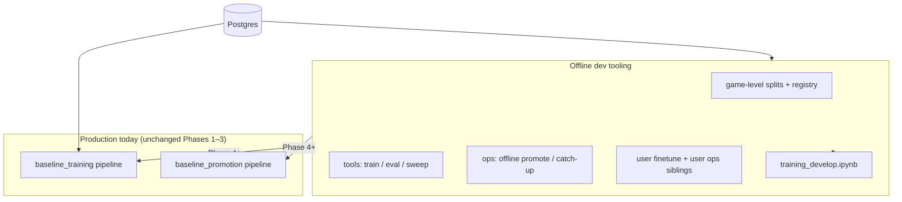

# ML training roadmap — baseline + personalized bots

**Status:** Phase 1 + 1b implemented on branch `feature/ml-phase1-eval-splits` (Phases 2–3 offline; production pipelines unchanged until Phase 4)

**Audience:** humans and coding agents working on `src/chess_teacher/pipelines/neural_network/`

**Last updated:** 2026-09-01 (rev: Phase 2a/2b sibling scripts, user-bot parallels, notebook surface)

---

## Design assumptions (agreed)

These choices simplify the roadmap; revisit only if metrics or product needs change.

| Topic | Assumption |
|-------|------------|
| **User overlap train/val** | Acceptable for platform baseline. A few moves per user in val do not reveal full style; signal comes from aggregate volume. |
| **Game-level split** | Required — never split moves within the same game. |
| **Offline sample size** | Small `--limit` runs are smoke tests only. Serious comparisons need **≥10k moves** (preferably more val games, e.g. hundreds). |
| **Incremental production training** | Cutoff-based batches (see below) are the primary temporal strategy — not a separate “train on all history every time” design. |
| **Recency (baseline)** | Optional **sample weights** within each new batch can emphasize fresher moves; the cutoff loader already restricts each round to **new** data since last train. |
| **Recency (user bots)** | Strong recency weights + time-ordered user val split (Phase 3). |

---

## Incremental training vs held-out eval (important)

Production baseline training is already **incremental by time**:

```
count_since(cutoff) >= MIN_NEW_MOVES (1000)
  → fetch_since(cutoff) oldest-first, cap MAX_MOVES (10k)
  → finetune from parent weights
  → advance last_trained_data_cutoff
```

Each training round sees only **new** moves since the last cutoff. That is the core “always learning from recent platform data” mechanism. You do **not** need a separate time-based val split to achieve incremental training — the cutoff pipeline already does that.

Two concerns that stay **orthogonal**:

| Concern | Mechanism | Purpose |
|---------|-----------|---------|
| **Incremental learning** | `fetch_since(cutoff)` + parent weights | Model adapts to new data over time |
| **Honest offline metrics** | Persistent game hash → val / test | Know if model generalizes to held-out games it never trained on |
| **Emphasize latest within a batch** | Optional recency sample weights | Within one 10k batch, weight newer `end_time` higher (baseline: light; user: strong) |

**Offline experiments** should mirror production intelligently:

- **Fixed val set** (persistent hash): score every candidate the same way — promotion-quality metric.
- **Time-ordered batch replay** (Phase 2): simulate catch-up — train batch₁, eval val; train batch₁+₂, eval val; … — stress-tests incremental finetuning without replacing the fixed val set.

Do **not** conflate “val must be future games” with “training must be incremental.” Your pipeline already handles the latter; persistent hash val handles generalization measurement.

---

## Purpose

This document captures the agreed phased plan for:

1. Fixing train / validation / test hygiene as baseline training matures
2. Improving baseline model quality (features, capacity) with honest metrics
3. Building **personalized user bots** on top of baseline models
4. Adding **recency bias** for user finetune (not baseline)

During **Phases 1–3**, implement **library code** under `pipelines/neural_network/` plus **thin scripts** under `scripts/tools/` and `scripts/ops/`. Do **not** wire new logic into `run_baseline_training_pipeline()` / orchestrated entrypoints until Phase 4.

---

## Experiment surfaces (scripts + notebook)

Same capabilities should be reachable from three places — **one library, many thin wrappers**:

| Surface | Role | Persists to pipeline DB? | When |
|---------|------|--------------------------|------|
| **`scripts/tools/`** | Single-shot experiments, sweeps, backfill | Usually no (terminal metrics) | Phases 1–3 |
| **`scripts/ops/`** | Sibling loops mimicking platform ops (catch-up, promote) | Optional MLflow later; not `baseline_models` until Phase 4 | Phase 2–3 |
| **`scripts/entrypoints/`** | Production-style jobs (orchestrated on platform) | Yes — candidates, cutoff, promotion | Phase 4+ |
| **`training_develop.ipynb`** | Interactive develop — inspect, train, compare, plot | Same as whichever cell you run (often pipeline today) | All phases — extend over time |

**Rule:** put logic in `splits.py`, `eval_metrics.py`, `split_registry.py`, trainers, etc. Scripts and notebook cells **call libraries** — do not duplicate training/eval logic in the notebook only.

### Baseline: script siblings vs production entrypoints

| Production (today) | Split-based sibling (offline) | Phase |
|--------------------|----------------------------------|-------|
| `scripts/entrypoints/baseline_training.py` | `scripts/tools/offline_baseline_train_eval.py` ✅ | 1 |
| `scripts/entrypoints/baseline_promotion.py` | `scripts/ops/offline_baseline_promotion.py` (proposed) | **2a** |
| `scripts/ops/baseline_train_until_caught_up.py` | `scripts/ops/offline_baseline_catch_up.py` (proposed) | **2b** |

Siblings use **registry val** + **stratified metrics**; exclude val/test from train. They do **not** replace entrypoints until Phase 4 merges the same eval/split logic inward.

### User bots: same pattern (Phase 3+)

| Future production (Phase 4) | Offline sibling | Phase |
|-----------------------------|-----------------|-------|
| `run_user_finetune_pipeline()` | `scripts/tools/offline_user_finetune_eval.py` | **3a** |
| User model promotion / A-B vs baseline | `scripts/ops/offline_user_promotion.py` (proposed) | **3b** |
| User retrain loop (new games since cutoff) | `scripts/ops/offline_user_catch_up.py` (proposed) | **3b** |

User splits: **time-ordered per account** (last 20% games = val), not platform hash registry. Shared: `eval_metrics.py`, weight helpers, `BaselineTrainer` finetune from production parent.

### Notebook (`training_develop.ipynb`)

Root notebook for interactive baseline work on develop. Extend incrementally — **do not fork** a second training notebook unless scope diverges sharply.

| Phase | Notebook additions (proposed) |
|-------|-------------------------------|
| **1 / 1b** ✅ | Cells: backfill status, registry split summary, call `evaluate_datums` on a loaded model URI |
| **2a** | Promotion-style compare (production vs candidate / two URIs) on registry val; epoch sweep table |
| **2b** | Mini catch-up replay (1–3 batches) with val curve plot |
| **3** | User section: pick `account_id`, time split, finetune, disagree metric vs baseline on user val |
| **4+** | Optional cells mirroring production promotion gates (read-only inspect before wiring) |

Notebook may call pipeline functions **or** offline library helpers — prefer **offline helpers** for split-based experiments so cells match `scripts/tools/` behaviour.

---

## Current state (baseline)

| Area | Today |
|------|--------|
| Model | Candidate-style: state tower `128→128`, per-move scorer `64`, up to 128 candidates × 55 move feats |
| Training | Incremental batches via `main.py` pipeline; trains on all fetched moves |
| Promotion | `RandomEvalSetProvider` — random 2k moves, may overlap training |
| Offline sweep | `scripts/tools/experiment_baseline_epochs.py` — 80/20 split by **move** (leakage risk) |
| Develop notebook | `training_develop.ipynb` — interactive baseline train/inspect (pipeline today; extend for split eval) |
| Personalization | Not implemented; `fetch_for_account()` and `training_state.scope = user:{id}` exist as scaffolding |
| Style weighting | `ply_weights.py` — ply reweight + SF-disagree boost (default max 2×) |

Key files:

- `src/chess_teacher/pipelines/neural_network/train.py` — architecture + training
- `src/chess_teacher/pipelines/neural_network/promotion.py` — eval + promotion
- `src/chess_teacher/pipelines/neural_network/create_training_set.py` — data loading
- `src/chess_teacher/pipelines/neural_network/ply_weights.py` — sample weights
- `src/chess_teacher/pipelines/neural_network/main.py` — production entrypoints

---

## Two problems, two models

| Model | Question it answers | Training data | Style / recency |
|-------|---------------------|---------------|-----------------|
| **Baseline** | “What would a typical platform user play?” | All users, incremental | Moderate SF-disagree boost (~1.5–2×); **no** heavy recency |
| **User bot** | “What would *this user* play — especially when they deviate from the engine?” | One `account_id` | High SF-disagree boost (3–5×); **recency bias**; regularize toward baseline |

Personalization quality is measured mainly on **SF-disagree** positions (user did not play engine-best). Baseline already does well on SF-agree lines; user bots must win on disagree subset without collapsing on agree.

---

## Glossary

| Term | Meaning |
|------|---------|
| **Train set** | Moves/games the model learns from |
| **Validation (val)** | Held-out games for epoch choice, model comparison, promotion |
| **Test set** | Frozen set for rare release checks — never tune on it |
| **Game-level split** | Entire games in one bucket only (never split moves from same game) |
| **SF-agree** | User move ≈ Stockfish best |
| **SF-disagree** | User move worse than SF-best — “style” signal |
| **Sample weight** | Per-example importance in loss (ply, disagree, recency) |
| **Recency bias** | Recent games weighted higher in loss — strong for **user finetune**; optional/light within baseline batches |
| **Split version (`salt`)** | Label for a frozen assignment policy, e.g. `baseline-v1` — bump when intentionally rotating val/test |
| **Split registry** | DB table mapping `(split_version, game_id) → bucket` — auditable, excludable from training queries |

---

## Architecture diagram



---

## Phase 1 — Trustworthy evaluation (offline)

**Goal:** Honest metrics on data the model never trained on.

**Problem:** Random or move-level splits leak information from the same game into train and val.

### Deliverables (done on `feature/ml-phase1-eval-splits`)

| Item | Path | Notes |
|------|------|-------|
| Game split module | `splits.py` | Hash `game_id` + salt → train 85% / val 10% / test 5% |
| Stratified metrics | `eval_metrics.py` | `top1_overall`, `top3_overall`, `top1_sf_agree`, `top1_sf_disagree` |
| Offline train+eval | `scripts/tools/offline_baseline_train_eval.py` | Train on train split; report val (+ optional `--eval-test`) |

### Split rule (baseline)

Deterministic per game:

```
bucket = hash(game_id + salt) % 100
  0–84  → train
  85–94 → val
  95–99 → test
```

Log per-split: game counts, move counts, SF-disagree fraction.

**Minimum sample guidance:** treat `--limit 2000` as dev smoke test; for decisions use `--limit 10000+` and check val has enough games (target **≥100 val games** when data allows).

### Exit criteria (Phase 1)

- One command produces stratified val metrics you trust for comparing runs
- **No changes** to `main.py` pipelines

---

## Phase 1b — Persistent split registry (offline infra)

**Goal:** Same hash rules as Phase 1, but assignments stored and reusable — ready for Phase 4 train exclusion without recomputing or drifting.

**Why now (same feature branch or follow-up):** In-memory hash in `splits.py` is correct but not auditable. Production needs “this `game_id` is val for `baseline-v1` forever” in one place.

### Deliverables

| Item | Path / location | Notes |
|------|-----------------|-------|
| Schema | `metadata.yml` → `ml.game_split_assignments` | PK `(split_version, game_id)`; columns `bucket`, `assigned_at` |
| Registry module | `split_registry.py` | `get_bucket(game_id)`, `ensure_assigned(game_id)`, bulk backfill, SQL exclude clause for val/test |
| Backfill script | `scripts/tools/backfill_game_splits.py` | Assign all known games for a `split_version`; idempotent |
| Wire offline tools | `offline_baseline_train_eval.py`, later epoch sweep | Filter datums via registry (or assign-on-read) instead of only in-memory split |
| Tests | `test_split_registry.py` | Deterministic assign; idempotent backfill; exclude filter |

### Table sketch

```yaml
game_split_assignments:
  schema: ml
  primary_key: [split_version, game_id]
  columns:
    - split_version   # e.g. baseline-v1 (= DEFAULT_SPLIT_SALT)
    - game_id
    - bucket          # train | val | test
    - assigned_at
```

**Assign rule:** same as `game_split_bucket()` — registry is the persistence layer, not a new policy.

**Phase 1b does not wire production training** — only DB + library + offline scripts. Phase 4 adds `fetch_since` / `LoadNewDataStep` exclusion using the registry.

### Exit criteria (Phase 1b)

- Backfill populates assignments for develop DB
- Offline train+eval uses registry; val game set stable across runs
- Documented `split_version` logged in script output (prep for MLflow in Phase 2+)

## Phase 2 — Baseline hyperparameters + ops siblings (offline)

Split into **2a** (compare / tune on fixed val) then **2b** (incremental replay). Still **no** production pipeline wiring.

### Phase 2a — Promotion sibling + sweeps

**Goal:** Compare models on **honest registry val**; pick epoch/arch defaults.

**Prerequisite:** Phase 1 terminal experiments trusted (`--limit 10000+`).

| Item | Path | Notes |
|------|------|-------|
| Epoch sweep | Upgrade `experiment_baseline_epochs.py` | Registry split + stratified val (not move-level 80/20) |
| **Promotion sibling** | `scripts/ops/offline_baseline_promotion.py` | Mimics `baseline_promotion.py`: score model A vs B on **full registry val**; stratified metrics; **no** `ApplyPromotionStep` / no DB promote |
| Arch sweep (optional) | `scripts/tools/offline_baseline_arch_sweep.py` | hidden 128 vs 256, score_hidden 64 vs 128 |
| Notebook | `training_develop.ipynb` | Cells: val compare two URIs; sweep results table |

**Promotion sibling behaviour (sketch):**

```
--split-version baseline-v1
--candidate-uri <mlflow or local .keras>   # or train inline
--baseline-uri <production .keras>         # optional; default fetch production
→ print stratified val for both; print delta; exit (no promote)
```

**Exit criteria (2a):** Documented defaults for `epochs`, `hidden`, `score_hidden`, `style_disagree_boost`. Can answer “would this beat production on registry val?”

### Phase 2b — Catch-up sibling + batch replay

**Goal:** Stress-test **incremental finetuning** with split hygiene (exclude val/test from each batch).

**Prerequisite:** Phase 2a defaults locked.

| Item | Path | Notes |
|------|------|-------|
| **Catch-up sibling** | `scripts/ops/offline_baseline_catch_up.py` | Mimics `baseline_train_until_caught_up.py`: replay `fetch_since` batches, finetune parent each round, **exclude registry val/test**, eval **same fixed val** after each round; optional `--max-rounds` |
| Feat v4 (optional) | `candidate_eval.py` bump | Only if sweeps plateau |
| Recency in batch (optional) | `ply_weights.py` | Light baseline batch recency — tune on val disagree |
| Notebook | `training_develop.ipynb` | Cells: 2–3 batch replay + val metric plot |

**Catch-up sibling vs production:** same loop *shape*, but train batches exclude holdout games and promotion uses registry val scorer — not `RandomEvalSetProvider`.

**Exit criteria (2b):** Val metrics stable or improving across replay rounds; ready to port eval + exclusion into Phase 4 entrypoints.

---

## Phase 3 — Personal bot experiments (offline)

**Goal:** User finetune beats baseline on user’s **disagree** val positions. Same **tools → ops → entrypoint** progression as baseline.

### Phase 3a — Single-user train + eval

| Item | Path | Notes |
|------|------|-------|
| Recency weights | Extend `ply_weights.py` or `recency_weights.py` | Strong for user; optional light baseline (Phase 2b) |
| User time split | `user_splits.py` (proposed) | Per `account_id`: sort by `end_time`, last 20% games = val |
| **Train+eval tool** | `scripts/tools/offline_user_finetune_eval.py` | Finetune from production baseline; report stratified metrics on **user val** |
| Notebook | `training_develop.ipynb` | User section: account picker, split summary, finetune, disagree metric vs baseline |

CLI example:

```text
--account-id <uuid>
--recency-lambda 0.02
--style-disagree-boost 4.0
```

**Exit criteria (3a):** For 2–3 accounts with enough games: user bot beats baseline on `top1_sf_disagree` on user val without large drop on `top1_sf_agree`.

### Phase 3b — User ops siblings

| Item | Path | Notes |
|------|------|-------|
| **User promotion sibling** | `scripts/ops/offline_user_promotion.py` | User finetuned model vs baseline on **that user’s val** (disagree primary) |
| **User catch-up sibling** | `scripts/ops/offline_user_catch_up.py` | Replay new user games since cutoff; recency weights; re-eval user val each round |
| Notebook | `training_develop.ipynb` | Compare user bot vs baseline on sample positions; retrain loop demo |

Min data gate: skip finetune if fewer than ~300 moves; serve baseline only.

### Training recipe (user scope)

1. Load **production baseline** as parent (frozen or very low LR)
2. Train on `TrainingDataStore.fetch_for_account(account_id)` — train portion only
3. Sample weights: `ply × style_disagree × recency`
4. Regularize toward baseline for low game counts (KL blend or small α at inference)

### User val split (within one account)

- Sort games by `games.end_time`
- **Last 20% of games** → user val
- **First 80%** → user train

Time-based split fits “recent style” better than platform hash for a single user.

### Recency bias (user finetune)

```
recency_weight = exp(λ * days_since_game)
w = normalize(ply_weight * style_disagree_weight * recency_weight)
```

- Tune `λ` on user val disagree metric (starting range λ ≈ 0.01–0.03)

**Optional later (Phase 3c):** opening-family boost from user’s recent games.

---

## Phase 4 — Wire into production

**Only after Phases 2–3 validated on develop data.** Merge proven **library + sibling** behaviour into entrypoints — offline ops siblings remain for sandbox experiments.

| Component | Change |
|-----------|--------|
| `LoadNewDataStep` | Exclude val/test `game_id`s via **split registry** (`split_version=baseline-v1`) |
| `RandomEvalSetProvider` | Replace with registry-backed val provider (same fixed games every promotion) |
| `DecidePromotionStep` | Primary: val overall top1; guardrail: val disagree top1 must not drop > X |
| `TrainIncrementalStep` | Optional early stopping on registry val; log `split_version` + val metrics to MLflow |
| `baseline_promotion.py` / catch-up ops | Use same scorers/splits as `offline_baseline_*` siblings |
| New pipeline | `run_user_finetune_pipeline(user_id)` — port logic from Phase 3 ops siblings |
| Inference | User model if exists, else baseline |
| Notebook | Document production vs offline paths; cells call production pipelines where appropriate |

Test set: manual / release-tag evaluation only — never promotion or epoch tuning.

**Note:** Incremental cutoff loading stays as-is; Phase 4 adds registry train exclusion + registry promotion eval atop existing `fetch_since`.

---

- Re-train user bot when N new games since cutoff
- Inference blend by game count: `(1−α)·baseline + α·user`
- UI: personalized vs baseline fallback
- “Recent opening” messaging when recency + opening weights apply

---

## Implementation checklist

| Step | Task | Surface | Touches production? | Status |
|------|------|---------|---------------------|--------|
| 1 | `splits.py` | library | No | done |
| 2 | `eval_metrics.py` | library | No | done |
| 3 | `offline_baseline_train_eval.py` | tools | No | done |
| 3b | Split registry + backfill | library + tools | No | done |
| 3c | Offline train uses registry | tools | No | done |
| 4a | Upgrade `experiment_baseline_epochs.py` | tools | No | |
| 4b | `offline_baseline_promotion.py` | **ops** | No | |
| 4c | Notebook: registry val compare | notebook | No | |
| 5a | `offline_baseline_catch_up.py` | **ops** | No | |
| 5b | `offline_baseline_arch_sweep.py` | tools | No | |
| 5c | Notebook: batch replay plot | notebook | No | |
| 6 | Recency weights (+ optional baseline batch) | library | No | |
| 7a | `user_splits.py` + `offline_user_finetune_eval.py` | library + tools | No | |
| 7b | `offline_user_promotion.py` + `offline_user_catch_up.py` | **ops** | No | |
| 7c | Notebook: user finetune section | notebook | No | |
| 8 | Promotion + train exclusion via registry | entrypoints | **Yes** | |
| 9 | User finetune pipeline + inference | entrypoints | **Yes** | |

---

## Agent instructions

When asked to implement part of this roadmap:

1. Read this file and the referenced source files under `pipelines/neural_network/`
2. Respect phase boundaries — **Phases 1–3 = library + tools/ops + notebook only**
3. Reuse `BaselineTrainer`, `TrainingBatch`, `candidate_style_sample_weights`, promotion scorers where possible
4. Split by **`game_id`**, not by move index; prefer **registry** for platform baseline
5. User bots: **time split per account** in Phase 3 — not platform hash registry
6. Report **stratified** metrics (overall / SF-agree / SF-disagree) in every eval script and notebook cell
7. **Ops siblings** mimic `scripts/entrypoints/` and `scripts/ops/` shape but stay split-based and non-promoting until Phase 4
8. **Notebook:** add cells that call the same library functions as scripts — no notebook-only training logic
9. Do not run `pytest` / `mypy` in agent — ask the user to run manually (project rule)
10. Serious offline runs: `--limit 10000+`; small limits are smoke tests only

---

## Current workflow (you are here)

1. **Terminal-only** — `backfill_game_splits.py` then `offline_baseline_train_eval.py` (no persist, no siblings yet)
2. **Phase 2a** — promotion sibling + epoch sweep + notebook compare cells
3. **Phase 2b** — catch-up sibling + notebook replay plot
4. **Phase 3** — user tools + user ops siblings + notebook user section
5. **Phase 4** — merge into entrypoints; siblings stay for sandbox

---

## Related conversation

Plan derived from architecture review session (baseline bot maturity, personalization, recency, ops siblings, `training_develop.ipynb`). Production pipelines intentionally left unchanged until offline phases prove metrics.
