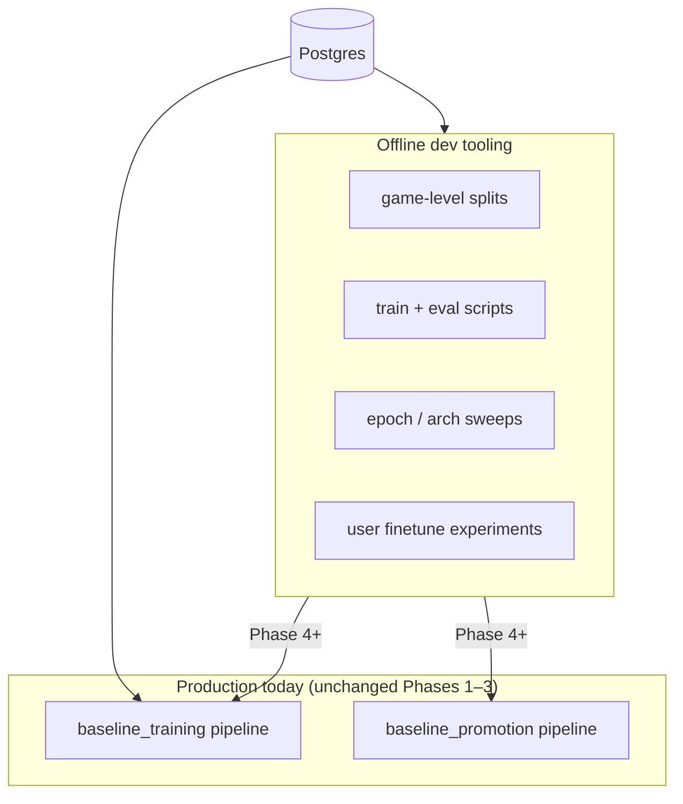

# ML training roadmap — baseline + personalized bots

**Status:** Phase 1 implemented on branch `feature/ml-phase1-eval-splits` (Phases 2–3 offline; production pipelines unchanged until Phase 4)

**Audience:** humans and coding agents working on `src/chess_teacher/pipelines/neural_network/`

**Last updated:** 2026-09-01

---

## Purpose

This document captures the agreed phased plan for:

1. Fixing train / validation / test hygiene as baseline training matures
2. Improving baseline model quality (features, capacity) with honest metrics
3. Building **personalized user bots** on top of baseline models
4. Adding **recency bias** for user finetune (not baseline)

During **Phases 1–3**, implement everything in **standalone scripts** under `scripts/tools/`. Do **not** wire new logic into `run_baseline_training_pipeline()` or `run_baseline_promotion_pipeline()` until Phase 4.

---

## Current state (baseline)

| Area | Today |
|------|--------|
| Model | Candidate-style: state tower `128→128`, per-move scorer `64`, up to 128 candidates × 55 move feats |
| Training | Incremental batches via `main.py` pipeline; trains on all fetched moves |
| Promotion | `RandomEvalSetProvider` — random 2k moves, may overlap training |
| Offline sweep | `scripts/tools/experiment_baseline_epochs.py` — 80/20 split by **move** (leakage risk) |
| Personalization | Not implemented; `fetch_for_account()` and `training_state.scope = user:{id}` exist as scaffolding |
| Style weighting | `ply_weights.py` — ply reweight + SF-disagree boost (default max 2×) |

Key files:

- `src/chess_teacher/pipelines/neural_network/train.py` — architecture + training
- `src/chess_teacher/pipelines/neural_network/promotion.py` — eval + promotion
- `src/chess_teacher/pipelines/neural_network/create_training_set.py` — data loading
- `src/chess_teacher/pipelines/neural_network/ply_weights.py` — sample weights
- `src/chess_teacher/pipelines/neural_network/main.py` — production entrypoints

---

## Two problems, two models

| Model | Question it answers | Training data | Style / recency |
|-------|---------------------|---------------|-----------------|
| **Baseline** | “What would a typical platform user play?” | All users, incremental | Moderate SF-disagree boost (~1.5–2×); **no** heavy recency |
| **User bot** | “What would *this user* play — especially when they deviate from the engine?” | One `account_id` | High SF-disagree boost (3–5×); **recency bias**; regularize toward baseline |

Personalization quality is measured mainly on **SF-disagree** positions (user did not play engine-best). Baseline already does well on SF-agree lines; user bots must win on disagree subset without collapsing on agree.

---

## Glossary

| Term | Meaning |
|------|---------|
| **Train set** | Moves/games the model learns from |
| **Validation (val)** | Held-out games for epoch choice, model comparison, promotion |
| **Test set** | Frozen set for rare release checks — never tune on it |
| **Game-level split** | Entire games in one bucket only (never split moves from same game) |
| **SF-agree** | User move ≈ Stockfish best |
| **SF-disagree** | User move worse than SF-best — “style” signal |
| **Sample weight** | Per-example importance in loss (ply, disagree, recency) |
| **Recency bias** | Recent games weighted higher — for **user finetune only** |

---

## Architecture diagram



---

## Phase 1 — Trustworthy evaluation (offline)

**Goal:** Honest metrics on data the model never trained on.

**Problem:** Random or move-level splits leak information from the same game into train and val.

### Deliverables

| Item | Path (proposed) | Notes |
|------|-----------------|-------|
| Game split module | `splits.py` | Hash `game_id` + salt → train 85% / val 10% / test 5% |
| Stratified metrics | `eval_metrics.py` | `top1_overall`, `top3_overall`, `top1_sf_agree`, `top1_sf_disagree` |
| Offline train+eval | `scripts/tools/offline_baseline_train_eval.py` | Train on train split; report val (+ optional `--eval-test`) |

### Split rule (baseline)

Deterministic per game:

```
bucket = hash(game_id + salt) % 100
  0–84  → train
  85–94 → val
  95–99 → test
```

Log per-split: game counts, move counts, SF-disagree fraction.

### Exit criteria

- One command produces stratified val metrics you trust for comparing runs
- **No changes** to `main.py` pipelines

---

## Phase 2 — Baseline hyperparameters (offline)

**Goal:** Pick epochs and architecture using Phase 1 tooling.

### Deliverables

| Item | Action |
|------|--------|
| Epoch sweep | Upgrade `experiment_baseline_epochs.py` → game-level split + stratified val metrics |
| Arch sweep | New `scripts/tools/offline_baseline_arch_sweep.py` — hidden 128 vs 256, score_hidden 64 vs 128 |
| Feat v4 (optional) | Only if sweeps plateau: SF rank, time control, ELO band, opening bucket — bump `CANDIDATE_MOVE_FEAT_VERSION` |

### Exit criteria

- Documented defaults for `epochs`, `hidden`, `score_hidden`, baseline `style_disagree_boost`
- Still **no** production pipeline wiring

---

## Phase 3 — Personal bot experiments (offline)

**Goal:** User finetune beats baseline on user’s **disagree** val positions.

### Training recipe (user scope)

1. Load **production baseline** as parent (frozen or very low LR)
2. Train on `TrainingDataStore.fetch_for_account(account_id)` — train portion only
3. Sample weights: `ply × style_disagree × recency` (see below)
4. Regularize toward baseline for low game counts (KL blend or small α at inference)

### User val split (within one account)

- Sort games by `games.end_time`
- **Last 20% of games** → user val
- **First 80%** → user train

Time-based split fits “recent style” better than random hash for a single user.

### Recency bias (user finetune only)

**Do not** apply heavy recency to baseline (stable platform prior).

For user finetune, multiply sample weights:

```
recency_weight = exp(λ * days_since_game)
w = normalize(ply_weight * style_disagree_weight * recency_weight)
```

- `days_since_game` = anchor_date − `games.end_time`
- Tune `λ` on user val disagree metric (starting range λ ≈ 0.01–0.03 → half-life ~23–70 days)

**Optional later (Phase 3b):** boost positions in opening families over-represented in user’s recent games.

### Min data gate

Skip user finetune if fewer than ~300 moves; serve baseline only.

### Deliverables

| Item | Path (proposed) |
|------|-----------------|
| Recency in weights | Extend `ply_weights.py` or new `recency_weights.py` |
| User finetune eval | `scripts/tools/offline_user_finetune_eval.py` |

CLI example:

```text
--account-id <uuid>
--recency-lambda 0.02
--style-disagree-boost 4.0
```

### Exit criteria

- For 2–3 accounts with enough games: user bot beats baseline on `top1_sf_disagree` on user val without large drop on `top1_sf_agree`

---

## Phase 4 — Wire into production

**Only after Phases 1–3 validated on develop data.**

| Component | Change |
|-----------|--------|
| `LoadNewDataStep` | Exclude val/test game IDs from training fetch |
| `RandomEvalSetProvider` | Replace with `HeldOutValSetProvider` (fixed hash split) |
| `DecidePromotionStep` | Primary: val overall top1; guardrail: val disagree top1 must not drop > X |
| `TrainIncrementalStep` | Optional early stopping on val |
| New pipeline | `run_user_finetune_pipeline(user_id)` — min games, recency, parent baseline, MLflow + DB |
| Inference | User model if exists, else baseline |

Test set: manual / release-tag evaluation only — never promotion or epoch tuning.

---

## Phase 5 — Product polish (later)

- Re-train user bot when N new games since cutoff
- Inference blend by game count: `(1−α)·baseline + α·user`
- UI: personalized vs baseline fallback
- “Recent opening” messaging when recency + opening weights apply

---

## Implementation checklist

| Step | Task | Touches production? | Status |
|------|------|---------------------|--------|
| 1 | `splits.py` | No | done |
| 2 | `eval_metrics.py` | No | done |
| 3 | `offline_baseline_train_eval.py` | No | done |
| 4 | Fix `experiment_baseline_epochs.py` (game split + stratified metrics) | No | |
| 5 | `offline_baseline_arch_sweep.py` | No | |
| 6 | Recency weights | No (offline first) | |
| 7 | `offline_user_finetune_eval.py` | No | |
| 8 | Promotion + train exclusion of held-out | **Yes** | |
| 9 | User finetune pipeline + inference routing | **Yes** | |

---

## Agent instructions

When asked to implement part of this roadmap:

1. Read this file and the referenced source files under `pipelines/neural_network/`
2. Respect phase boundaries — **Phases 1–3 = scripts + library modules only**
3. Reuse `BaselineTrainer`, `TrainingBatch`, `candidate_style_sample_weights`, promotion scorers where possible
4. Split by **`game_id`**, not by move index
5. Report **stratified** metrics (overall / SF-agree / SF-disagree) in every eval script
6. User finetune: emphasize disagree + recency; baseline: keep disagree boost moderate
7. Do not run `pytest` / `mypy` in agent — ask the user to run manually (project rule)

---

## Related conversation

Plan derived from architecture review session (baseline bot maturity, personalization, recency). Production pipelines intentionally left unchanged until offline phases prove metrics.
